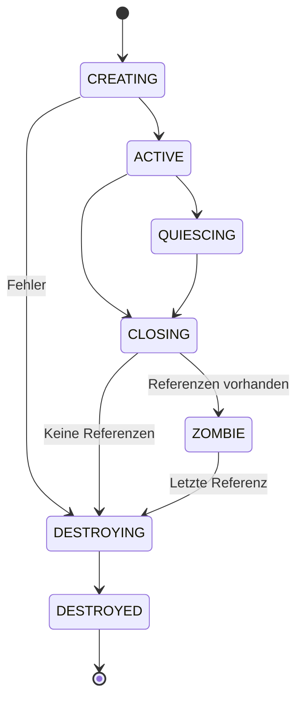
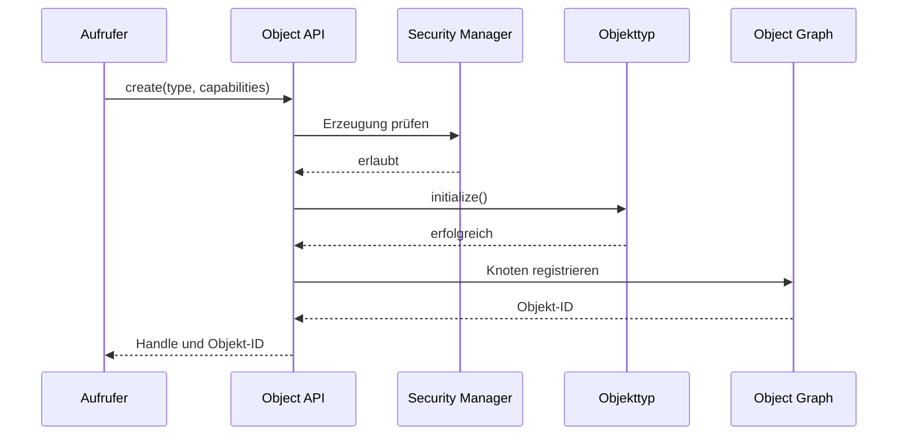

# NPSPEC-KERNEL-0102 – Unified Object API

| Feld | Wert |
|---|---|
| Dokument-ID | NPSPEC-KERNEL-0102 |
| Titel | Unified Object API |
| Status | Spezifikation |
| Version | 1.0 |
| Datum | 2026-08-03 |
| Bereich | Kernel / Object Management |
| Verantwortlich | NovaOS Architecture Team |
| Abhängigkeiten | NPSPEC-KERNEL-0012, NPSPEC-KERNEL-0013, NPSPEC-KERNEL-0100, NPSPEC-KERNEL-0101 |
| Zugehörige ADRs | ADR-SEC-0006, ADR-IPC-0005 |

---

## 1. Zweck

Die Unified Object API stellt eine einheitliche Schnittstelle für den Zugriff auf Kernelobjekte bereit.

Sie vereinheitlicht:

- Objekterzeugung
- Namensauflösung
- Referenzverwaltung
- Handle-Erzeugung
- Zugriffsprüfung
- Attributabfragen
- Ereignisüberwachung
- Lebenszyklussteuerung

Subsysteme verwenden diese API, anstatt eigene inkompatible Objekt- und Handle-Mechanismen zu implementieren.

---

## 2. Geltungsbereich

Die Spezifikation gilt für alle verwalteten Kernelobjekte, darunter:

- Prozesse
- Threads
- Jobs
- Speicherobjekte
- Dateien und Verzeichnisse
- Geräte
- Treiber
- IPC-Endpunkte
- Events
- Timer
- Netzwerkendpunkte
- Sicherheitskontexte
- Kernelmodule

Nicht jedes Objekt muss sämtliche Operationen unterstützen.

---

## 3. Entwurfsziele

Die Unified Object API MUSS:

- typisierte Kernelobjekte bereitstellen,
- einheitliche Lebenszyklusregeln verwenden,
- capability-basierte Zugriffe unterstützen,
- direkte Kernelzeiger vor Userspace-Prozessen verbergen,
- Race Conditions bei Objektzugriffen verhindern,
- versionierbare Schnittstellen anbieten,
- den Kernel Object Graph integrieren,
- synchrone und asynchrone Operationen ermöglichen,
- Debugging und Auditierung unterstützen.

---

## 4. Nichtziele

Die API ist nicht verantwortlich für:

- subsysteminterne Algorithmen,
- Dateisystemformate,
- Netzwerkprotokolle,
- Treiberimplementierungen,
- Scheduling-Entscheidungen,
- vollständige Objektpersistenz über Neustarts hinweg.

Persistente Ressourcen dürfen über stabile Objektidentitäten referenziert werden, ihre Wiederherstellung bleibt jedoch Aufgabe des jeweiligen Subsystems.

---

## 5. Grundmodell

Jedes verwaltete Objekt besitzt mindestens:

| Eigenschaft | Bedeutung |
|---|---|
| Objekt-ID | Kernelweit eindeutige Identität |
| Typ-ID | Identifiziert den Objekttyp |
| Generation | Erkennt veraltete Referenzen |
| Zustand | Aktueller Lebenszykluszustand |
| Referenzzähler | Anzahl aktiver Kernelreferenzen |
| Sicherheitsdeskriptor | Zugriffsregeln des Objekts |
| Attribute | Typisierte Objektmetadaten |
| Operations-Tabelle | Implementierte Objektoperationen |
| Graphknoten | Eintrag im Kernel Object Graph |

---

## 6. Objektidentität

Die öffentliche Objektidentität wird durch `nova_object_id_t` dargestellt.

```c
typedef struct nova_object_id {
    uint64_t value;
    uint32_t generation;
    uint32_t type_id;
} nova_object_id_t;
```

Die Kombination aus Objekt-ID und Generation MUSS verhindern, dass eine freigegebene und später wiederverwendete Objekt-ID irrtümlich als dasselbe Objekt behandelt wird.

Kernelzeiger DÜRFEN NICHT als öffentliche Objektidentitäten verwendet werden.

---

## 7. Objekttypen

Jeder Objekttyp wird durch einen registrierten Typdeskriptor beschrieben.

```c
typedef struct nova_object_type {
    nova_type_id_t              type_id;
    const char                 *name;
    uint32_t                    abi_version;
    uint32_t                    flags;
    size_t                      instance_size;
    const nova_object_ops_t    *operations;
    const nova_attribute_set_t *attributes;
} nova_object_type_t;
```

Die Registrierung eines Typs MUSS vor der Erzeugung seiner Instanzen erfolgen.

---

## 8. Typklassen

Objekttypen können einer oder mehreren Klassen angehören:

| Typklasse | Beispiele |
|---|---|
| Ausführbar | Prozess, Thread |
| Synchronisierbar | Event, Timer, Semaphore |
| Adressierbar | Datei, Gerät, IPC-Endpunkt |
| Speicherbasiert | Shared Memory, Section |
| Hierarchisch | Verzeichnis, Device Node, Job |
| Beobachtbar | Prozess, Gerät, Netzwerkendpunkt |
| Persistierbar | Datei, Volume, Konfigurationsobjekt |

Typklassen erlauben generische Operationen, ohne konkrete Implementierungsdetails offenzulegen.

---

## 9. Lebenszyklus

Ein Objekt durchläuft grundsätzlich folgende Zustände:

| Zustand | Bedeutung |
|---|---|
| `CREATING` | Objekt wird initialisiert |
| `ACTIVE` | Objekt ist vollständig verwendbar |
| `QUIESCING` | Neue Operationen werden eingeschränkt |
| `CLOSING` | Objekt wird geschlossen |
| `ZOMBIE` | Logisch beendet, aber noch referenziert |
| `DESTROYING` | Ressourcen werden freigegeben |
| `DESTROYED` | Objekt ist nicht mehr gültig |

Nicht jeder Objekttyp muss den Zustand `ZOMBIE` verwenden.

---

## 10. Zustandsübergänge



Zustandsübergänge MÜSSEN atomar oder durch geeignete Sperren geschützt sein.

---

## 11. Objekterzeugung

Die generische Erzeugung erfolgt über:

```c
nova_status_t nova_object_create(
    nova_type_id_t type_id,
    const nova_object_create_info_t *create_info,
    nova_capability_set_t requested_capabilities,
    nova_handle_t *out_handle,
    nova_object_id_t *out_object_id
);
```

Die Operation MUSS:

1. den Objekttyp validieren,
2. die Erzeugungsberechtigung prüfen,
3. Speicher reservieren,
4. die Basisstruktur initialisieren,
5. den typspezifischen Konstruktor ausführen,
6. den Sicherheitsdeskriptor installieren,
7. das Objekt im Kernel Object Graph registrieren,
8. ein Handle erzeugen,
9. das Objekt atomar aktivieren.

Bei einem Fehler MUSS die Erzeugung vollständig zurückgerollt werden.

---

## 12. Objektreferenzen

Kernelkomponenten verwenden referenzgezählte Objektzeiger.

```c
nova_status_t nova_object_reference(
    nova_object_id_t object_id,
    nova_type_id_t expected_type,
    nova_object_t **out_object
);

void nova_object_retain(nova_object_t *object);
void nova_object_release(nova_object_t *object);
```

Eine erfolgreiche Referenzierung MUSS garantieren, dass das Objekt bis zum zugehörigen `nova_object_release()` nicht freigegeben wird.

---

## 13. Handle-basierter Zugriff

Userspace-Komponenten greifen ausschließlich über Handles auf Kernelobjekte zu.

```c
nova_status_t nova_object_from_handle(
    nova_handle_t handle,
    nova_type_id_t expected_type,
    nova_capability_set_t required_capabilities,
    nova_object_t **out_object
);
```

Die Auflösung MUSS prüfen:

- Handle-Gültigkeit
- Handle-Generation
- erwarteten Objekttyp
- erforderliche Capabilities
- Objektzustand
- Sicherheitskontext des Aufrufers

---

## 14. Handle-Erzeugung

```c
nova_status_t nova_object_open_handle(
    nova_object_t *object,
    nova_process_t *target_process,
    nova_capability_set_t capabilities,
    uint32_t flags,
    nova_handle_t *out_handle
);
```

Die zugewiesenen Capabilities DÜRFEN die Rechte des Erzeugers oder des Sicherheitsdeskriptors nicht überschreiten.

---

## 15. Capability-Modell

Capabilities beschreiben erlaubte Operationen.

Allgemeine Capabilities sind:

| Capability | Bedeutung |
|---|---|
| `OBJECT_QUERY` | Objektinformationen lesen |
| `OBJECT_MODIFY` | Attribute oder Zustand verändern |
| `OBJECT_SIGNAL` | Objekt signalisieren |
| `OBJECT_WAIT` | Auf Objekt warten |
| `OBJECT_DUPLICATE` | Handle duplizieren |
| `OBJECT_TRANSFER` | Handle an anderen Prozess übertragen |
| `OBJECT_SUBSCRIBE` | Objektänderungen abonnieren |
| `OBJECT_DELETE` | Objektlöschung anfordern |
| `OBJECT_ADMIN` | Administrative Operationen |

Typspezifische Capabilities ergänzen diese Basismenge.

---

## 16. Capability-Reduktion

Handles dürfen mit reduzierten Rechten dupliziert werden.

```c
nova_status_t nova_handle_restrict(
    nova_handle_t source,
    nova_capability_set_t reduced_capabilities,
    nova_handle_t *out_handle
);
```

Eine nachträgliche Erweiterung der Rechte ist ohne erneute Autorisierung unzulässig.

---

## 17. Namensauflösung

Benannte Objekte können über Namespaces geöffnet werden.

```c
nova_status_t nova_object_open(
    nova_handle_t namespace_handle,
    const nova_string_view_t *name,
    nova_type_id_t expected_type,
    nova_capability_set_t requested_capabilities,
    nova_handle_t *out_handle
);
```

Namen MÜSSEN relativ zu einem expliziten Namespace oder Namespace-Handle interpretiert werden.

Globale implizite Namensräume SOLLTEN vermieden werden.

---

## 18. Objektpfade

Ein Objektpfad besteht aus validierten Namenskomponenten.

Beispiel:

```text
/system/devices/pci/0000:00:1f.2
```

Die Namensauflösung MUSS:

- Traversal-Rechte prüfen,
- symbolische Verweise begrenzen,
- Namespace-Grenzen beachten,
- Schleifen erkennen,
- die maximale Pfadlänge durchsetzen.

---

## 19. Objektoperationen

Jeder Objekttyp stellt eine Operations-Tabelle bereit.

```c
typedef struct nova_object_ops {
    nova_status_t (*initialize)(nova_object_t *, const void *);
    nova_status_t (*activate)(nova_object_t *);
    nova_status_t (*query)(nova_object_t *, nova_query_t *);
    nova_status_t (*set)(nova_object_t *, const nova_update_t *);
    nova_status_t (*invoke)(nova_object_t *, nova_invocation_t *);
    nova_status_t (*wait)(nova_object_t *, nova_wait_context_t *);
    nova_status_t (*close)(nova_object_t *);
    void          (*destroy)(nova_object_t *);
} nova_object_ops_t;
```

Nicht unterstützte Operationen MÜSSEN `NOVA_STATUS_NOT_SUPPORTED` zurückgeben.

---

## 20. Generische Abfragen

Objektinformationen werden über versionierte Abfrageklassen gelesen.

```c
nova_status_t nova_object_query(
    nova_handle_t handle,
    nova_query_class_t query_class,
    void *buffer,
    size_t buffer_size,
    size_t *out_required_size
);
```

Mindestens folgende Abfragen sind vorgesehen:

- Basisidentität
- Objekttyp
- Lebenszykluszustand
- Erzeugungszeit
- Sicherheitsinformationen
- Statistiken
- Beziehungen im Kernel Object Graph
- unterstützte Operationen
- unterstützte Attribute

---

## 21. Attribute

Attribute besitzen eine stabile ID, einen Datentyp und Zugriffsregeln.

```c
typedef struct nova_attribute_descriptor {
    nova_attribute_id_t id;
    const char         *name;
    nova_value_type_t   value_type;
    uint32_t            flags;
    size_t              maximum_size;
} nova_attribute_descriptor_t;
```

Mögliche Attributflags:

- lesbar
- schreibbar
- unveränderlich
- privilegiert
- auditpflichtig
- flüchtig
- persistent
- sensitiv

---

## 22. Attribute lesen

```c
nova_status_t nova_object_get_attribute(
    nova_handle_t handle,
    nova_attribute_id_t attribute,
    void *buffer,
    size_t buffer_size,
    size_t *out_required_size
);
```

Sensitive Attribute DÜRFEN nur mit expliziter Capability zurückgegeben werden.

---

## 23. Attribute schreiben

```c
nova_status_t nova_object_set_attribute(
    nova_handle_t handle,
    nova_attribute_id_t attribute,
    const void *value,
    size_t value_size,
    uint32_t flags
);
```

Die Implementierung MUSS den neuen Wert vollständig validieren, bevor der bestehende Wert verändert wird.

Teilweise Aktualisierungen sind nur zulässig, wenn der betreffende Attributtyp dies ausdrücklich unterstützt.

---

## 24. Transaktionale Aktualisierungen

Mehrere Attribute können atomar aktualisiert werden.

```c
nova_status_t nova_object_update(
    nova_handle_t handle,
    const nova_attribute_update_t *updates,
    size_t update_count,
    uint32_t flags
);
```

Mit `NOVA_UPDATE_ATOMIC` gilt:

- Entweder werden alle Änderungen übernommen,
- oder keine Änderung wird sichtbar.

---

## 25. Methodenaufrufe

Typspezifische Funktionen werden als versionierte Methoden aufgerufen.

```c
nova_status_t nova_object_invoke(
    nova_handle_t handle,
    nova_method_id_t method,
    const void *input,
    size_t input_size,
    void *output,
    size_t output_size,
    size_t *out_required_size
);
```

Methoden-IDs MÜSSEN innerhalb eines Objekttyps stabil bleiben.

---

## 26. Asynchrone Operationen

Lang laufende Operationen können asynchron gestartet werden.

```c
nova_status_t nova_object_invoke_async(
    nova_handle_t handle,
    nova_method_id_t method,
    const void *input,
    size_t input_size,
    nova_handle_t completion_object,
    nova_request_id_t *out_request_id
);
```

Der Abschluss wird über eines oder mehrere der folgenden Verfahren gemeldet:

- Completion Object
- Event Bus
- Completion Queue
- IPC-Antwort
- explizite Statusabfrage

---

## 27. Abbruch asynchroner Operationen

```c
nova_status_t nova_object_cancel(
    nova_handle_t handle,
    nova_request_id_t request_id,
    uint32_t flags
);
```

Ein erfolgreicher Abbruch bedeutet, dass die Operation keine weiteren sichtbaren Änderungen erzeugt.

Kann die Operation nicht mehr abgebrochen werden, MUSS ein eindeutiger Status zurückgegeben werden.

---

## 28. Warten auf Objekte

Wartefähige Objekte implementieren die Wait-Schnittstelle.

```c
nova_status_t nova_object_wait(
    const nova_handle_t *handles,
    size_t handle_count,
    nova_wait_mode_t mode,
    nova_time_ns_t timeout,
    nova_wait_result_t *out_result
);
```

Unterstützte Modi:

- Warten auf ein Objekt
- Warten auf irgendein Objekt
- Warten auf alle Objekte
- Abbruch bei Signal
- absoluter oder relativer Timeout

---

## 29. Ereignisabonnements

Objektänderungen können über den Event Bus abonniert werden.

```c
nova_status_t nova_object_subscribe(
    nova_handle_t object_handle,
    const nova_event_filter_t *filter,
    nova_handle_t event_queue,
    nova_subscription_id_t *out_subscription
);
```

Mögliche Ereignisse sind:

- Objekt erzeugt
- Objekt aktiviert
- Attribut geändert
- Zustand geändert
- Beziehung hinzugefügt
- Beziehung entfernt
- Objekt geschlossen
- Objekt zerstört
- Fehler aufgetreten

---

## 30. Kernel Object Graph

Jedes verwaltete Objekt SOLL als Knoten im Kernel Object Graph registriert werden.

Mögliche Beziehungen sind:

| Beziehung | Beispiel |
|---|---|
| `OWNS` | Prozess besitzt Thread |
| `PARENT_OF` | Job enthält Prozess |
| `USES` | Prozess verwendet Datei |
| `BACKED_BY` | Mapping basiert auf Speicherobjekt |
| `BOUND_TO` | Treiber ist an Gerät gebunden |
| `CONNECTED_TO` | Socket ist mit Endpunkt verbunden |
| `MEMBER_OF` | CPU gehört zu NUMA-Knoten |
| `SECURED_BY` | Objekt verwendet Sicherheitskontext |

Graphänderungen MÜSSEN mit dem Objektlebenszyklus konsistent bleiben.

---

## 31. Objektauflistung

Objekte können nach Typ, Namespace oder Graphbeziehung aufgelistet werden.

```c
nova_status_t nova_object_enumerate(
    const nova_object_filter_t *filter,
    nova_cursor_t *cursor,
    nova_object_summary_t *entries,
    size_t entry_capacity,
    size_t *out_entry_count
);
```

Auflistungen MÜSSEN den Zugriffsrechten des Aufrufers entsprechen.

Nicht sichtbare Objekte dürfen weder als Eintrag noch über Zähler offengelegt werden, wenn dies sicherheitsrelevante Informationen preisgeben würde.

---

## 32. Momentaufnahmen

Für Diagnosezwecke kann eine konsistente Sicht auf eine Objektmenge erzeugt werden.

```c
nova_status_t nova_object_snapshot_create(
    const nova_object_filter_t *filter,
    uint32_t flags,
    nova_handle_t *out_snapshot
);
```

Eine Momentaufnahme enthält Metadaten, aber standardmäßig keine sensitiven Nutzdaten.

---

## 33. Objektschließung

Das Schließen eines Handles entfernt die zugehörige Handle-Referenz.

```c
nova_status_t nova_handle_close(nova_handle_t handle);
```

Das Schließen des letzten Handles zerstört ein Objekt nicht zwingend. Weitere Referenzen können bestehen durch:

- Kernelkomponenten
- Graphbeziehungen
- laufende Operationen
- andere Prozesse
- persistente Registrierungen

---

## 34. Objektlöschung

Eine explizite Löschanforderung erfolgt über:

```c
nova_status_t nova_object_delete(
    nova_handle_t handle,
    uint32_t flags
);
```

Je nach Objekttyp kann die Löschung:

- sofort erfolgen,
- bis zum letzten Handle verzögert werden,
- asynchron ausgeführt werden,
- wegen aktiver Abhängigkeiten abgelehnt werden.

---

## 35. Abhängigkeiten und Besitz

Besitzbeziehungen MÜSSEN explizit modelliert werden.

Ein Objekt darf nicht allein aufgrund eines gespeicherten Zeigers als Eigentümer eines anderen Objekts gelten.

Für jede starke Beziehung MUSS definiert sein:

- ob sie eine Referenz hält,
- wer sie auflösen darf,
- wann sie automatisch entfernt wird,
- wie Zyklen behandelt werden.

---

## 36. Zyklische Referenzen

Referenzzählung allein kann zyklische Objektgraphen nicht freigeben.

Daher MÜSSEN zyklische Beziehungen mindestens eine der folgenden Eigenschaften besitzen:

- eine schwache Kante,
- einen expliziten Eigentümer,
- eine subsystemgesteuerte Auflösung,
- eine graphbasierte Bereinigung.

Ein allgemeiner Garbage Collector ist für Kernelobjekte nicht vorgesehen.

---

## 37. Weak References

Schwache Referenzen verlängern die Lebensdauer eines Objekts nicht.

```c
nova_status_t nova_object_weak_reference_create(
    nova_object_t *object,
    nova_weak_reference_t *out_reference
);

nova_status_t nova_object_weak_reference_lock(
    const nova_weak_reference_t *reference,
    nova_object_t **out_object
);
```

Das Sperren einer schwachen Referenz MUSS fehlschlagen, wenn die Zerstörung bereits begonnen hat.

---

## 38. Nebenläufigkeit

Die Unified Object API MUSS gleichzeitige Zugriffe von mehreren CPUs unterstützen.

Dabei gelten folgende Regeln:

- Referenzzähler werden atomar verwaltet.
- Lebenszyklusübergänge sind serialisiert.
- Attributzugriffe beachten die Sperrstrategie des Objekttyps.
- Operations-Tabellen sind nach Aktivierung unveränderlich.
- Destruktoren laufen erst nach Abschluss geschützter Operationen.
- Callback-Aufrufe erfolgen nicht unter globalen Objektsperren.

---

## 39. RCU und verzögerte Freigabe

Für leselastige Objektverzeichnisse darf Read-Copy-Update verwendet werden.

Nach der logischen Entfernung eines Objekts MUSS dessen Speicher bis zum Ende aller relevanten Read-Side Critical Sections gültig bleiben.

Die Objektgeneration wird bereits bei der logischen Entfernung ungültig.

---

## 40. Reentrancy

Typspezifische Operationen MÜSSEN dokumentieren, ob sie:

- reentrant,
- thread-safe,
- interrupt-safe,
- blockierend,
- im Panic-Kontext verwendbar

sind.

Die Unified Object API DARF nicht davon ausgehen, dass jeder Objekttyp reentrant ist.

---

## 41. Ausführungskontexte

Operationen werden nach zulässigem Kontext klassifiziert:

| Kontext | Zulässige Operationen |
|---|---|
| Thread-Kontext | Alle autorisierten Operationen |
| Interrupt-Kontext | Nur nicht blockierende Fast-Path-Operationen |
| Early Boot | Statisch registrierte Basistypen |
| Shutdown | Eingeschränkte Query- und Close-Operationen |
| Panic-Kontext | Lockfreie Diagnoseabfragen |

Nicht zulässige Kontextverwendungen MÜSSEN in Debug-Builds erkannt werden.

---

## 42. Speicherverwaltung

Die Objektbasisstruktur wird durch den Object Manager verwaltet.

Typspezifischer Speicher darf:

- inline in der Objektinstanz,
- als referenzgezählter Zusatzspeicher,
- in subsystemeigenen Pools

gespeichert werden.

Destruktoren MÜSSEN sämtliche typspezifischen Ressourcen freigeben.

---

## 43. Sicherheitsprüfung

Vor einer Operation MUSS die API mindestens prüfen:

1. Identität des Aufrufers,
2. Handle-Capabilities,
3. Sicherheitsdeskriptor des Objekts,
4. Namespace- und Containergrenzen,
5. aktuelle Systemrichtlinien,
6. Objektzustand,
7. typspezifische Einschränkungen.

Eine Capability ersetzt nicht automatisch sämtliche Richtlinienprüfungen.

---

## 44. Sicherheitsdeskriptoren

Jedes sicherheitsrelevante Objekt besitzt einen Sicherheitsdeskriptor mit:

- Eigentümer
- Sicherheitsdomäne
- Zugriffsregeln
- Integritätsstufe
- Auditregeln
- optionalen Labels
- Vererbungsregeln

Änderungen am Sicherheitsdeskriptor benötigen eine gesonderte administrative Capability.

---

## 45. Namespace-Isolation

Prozesse können unterschiedliche Sichten auf denselben Kernel Object Graph besitzen.

Die API MUSS unterstützen:

- private Namespaces,
- Container-Namespaces,
- kontrollierte Objektfreigaben,
- schreibgeschützte Projektionen,
- capability-basierte Namespace-Übergänge.

Eine Objekt-ID allein gewährt keinen Zugriff auf ein Objekt.

---

## 46. Datenschutz

Diagnose- und Auflistungsoperationen MÜSSEN dem Prinzip der Datenminimierung folgen.

Standardmäßig dürfen nicht offengelegt werden:

- Dateiinhalte
- IPC-Nutzdaten
- kryptografische Schlüssel
- vollständige Netzwerkpakete
- Benutzergeheimnisse
- sensible Speicherbereiche
- vertrauliche Objektattribute

Telemetry bleibt standardmäßig lokal und muss explizit aktiviert werden.

---

## 47. Auditierung

Sicherheitsrelevante Operationen SOLLEN Audit-Ereignisse erzeugen.

Auditpflichtig sind insbesondere:

- privilegierte Objekterzeugung,
- Rechteerweiterungsversuche,
- Sicherheitsdeskriptoränderungen,
- Handle-Übertragungen zwischen Sicherheitsdomänen,
- administrative Löschungen,
- wiederholte Zugriffsverletzungen.

Audit-Ereignisse dürfen keine geheimen Nutzdaten enthalten.

---

## 48. Fehlerbehandlung

Wichtige Statuscodes sind:

| Status | Bedeutung |
|---|---|
| `NOVA_STATUS_SUCCESS` | Operation erfolgreich |
| `NOVA_STATUS_INVALID_HANDLE` | Handle ist ungültig |
| `NOVA_STATUS_STALE_REFERENCE` | Generation stimmt nicht überein |
| `NOVA_STATUS_TYPE_MISMATCH` | Objekttyp entspricht nicht der Erwartung |
| `NOVA_STATUS_ACCESS_DENIED` | Berechtigung fehlt |
| `NOVA_STATUS_INVALID_STATE` | Objektzustand erlaubt die Operation nicht |
| `NOVA_STATUS_NOT_SUPPORTED` | Operation wird vom Typ nicht unterstützt |
| `NOVA_STATUS_BUFFER_TOO_SMALL` | Ausgabepuffer ist zu klein |
| `NOVA_STATUS_OBJECT_CLOSING` | Objekt wird bereits geschlossen |
| `NOVA_STATUS_OBJECT_NOT_FOUND` | Objekt konnte nicht aufgelöst werden |
| `NOVA_STATUS_CONFLICT` | Änderung kollidiert mit bestehendem Zustand |
| `NOVA_STATUS_WOULD_BLOCK` | Operation würde im aktuellen Kontext blockieren |
| `NOVA_STATUS_TIMEOUT` | Zeitlimit wurde überschritten |
| `NOVA_STATUS_CANCELLED` | Operation wurde abgebrochen |

---

## 49. ABI-Versionierung

Alle öffentlichen Strukturen MÜSSEN Größen- und Versionsfelder enthalten.

```c
typedef struct nova_object_create_info {
    uint32_t size;
    uint32_t version;
    uint32_t flags;
    nova_handle_t parent;
    const void *type_data;
    size_t type_data_size;
} nova_object_create_info_t;
```

Neue Felder dürfen nur am Ende ergänzt werden.

Unbekannte optionale Felder werden ignoriert, sofern die angegebene Strukturgröße eine sichere Verarbeitung erlaubt.

---

## 50. Kompatibilität

Die Kernel-ABI MUSS zwischen konkreten Kernelversionen eindeutig versioniert werden.

Folgende Stabilitätsstufen werden unterschieden:

| Stufe | Bedeutung |
|---|---|
| Intern | Darf sich zwischen Builds ändern |
| Kernelmodul-ABI | Innerhalb definierter Kompatibilitätsreihen stabil |
| System-Call-ABI | Langfristig rückwärtskompatibel |
| Userspace-SDK | Quellcodekompatible Abstraktion |

Userspace-Anwendungen dürfen nicht direkt von internen Objektstrukturen abhängen.

---

## 51. Diagnose

Die Diagnoseansicht eines Objekts SOLL enthalten:

- Objekt-ID und Generation
- Typname und Typversion
- Lebenszykluszustand
- Referenz- und Handle-Zähler
- Eigentümer und Sicherheitsdomäne
- Erzeugungszeit
- letzte Zustandsänderung
- aktive Operationen
- Graphbeziehungen
- Fehlerzähler

Sensitive Felder werden entsprechend den Rechten des Aufrufers maskiert.

---

## 52. Statistiken

Der Object Manager SOLL mindestens folgende Zähler führen:

- aktive Objekte pro Typ
- erzeugte und zerstörte Objekte
- fehlgeschlagene Erzeugungen
- aktive Handles
- veraltete Handle-Zugriffe
- verweigerte Zugriffe
- asynchrone Operationen
- abgebrochene Operationen
- maximale Objektzahl
- Destruktionslatenz

Zähler MÜSSEN SMP-sicher und möglichst kostengünstig aktualisiert werden.

---

## 53. Performance-Anforderungen

Für häufige Operationen gelten folgende Ziele:

- Handle-Auflösung ohne globale Sperre
- konstante oder amortisiert konstante Objekt-ID-Auflösung
- keine dynamische Speicherallokation im reinen Query-Fast-Path
- lokale Referenzoperationen mit atomaren CPU-Instruktionen
- skalierbare per-CPU- oder shard-basierte Tabellen
- begrenzte Kosten für Event- und Audit-Erzeugung

Sicherheit und Korrektheit haben Vorrang vor Fast-Path-Optimierungen.

---

## 54. Ressourcenlimits

Das System MUSS Limits unterstützen für:

- Objekte pro Prozess
- Handles pro Prozess
- Objekte pro Sicherheitsdomäne
- offene asynchrone Operationen
- Abonnements
- Momentaufnahmen
- benannte Objekte
- objektspezifischen Kernelspeicher

Limitüberschreitungen MÜSSEN kontrolliert und ohne Kernelinstabilität behandelt werden.

---

## 55. Early-Boot-Verhalten

Während des frühen Bootvorgangs dürfen nur statisch registrierte Kernobjekttypen verwendet werden.

In dieser Phase:

- kann ein vereinfachter Allocator eingesetzt werden,
- steht eventuell noch kein vollständiger Namespace bereit,
- werden Ereignisse in einem begrenzten Early-Boot-Puffer gesammelt,
- sind Audit- und Sicherheitsdienste nur eingeschränkt verfügbar.

Nach Aktivierung des vollständigen Object Managers werden Early-Boot-Objekte übernommen oder kontrolliert ersetzt.

---

## 56. Shutdown-Verhalten

Beim Herunterfahren wechselt der Object Manager in einen eingeschränkten Modus.

Neue nicht essenzielle Objekte werden abgelehnt.

Die Auflösung erfolgt in definierter Reihenfolge:

1. Userspace-Zugriffe stoppen,
2. asynchrone Operationen beenden,
3. Geräte und Treiber herunterfahren,
4. persistente Zustände sichern,
5. Namespaces schließen,
6. verbleibende Kernelobjekte freigeben.

---

## 57. Panic-Modus

Im Panic-Kontext steht nur eine minimale, nicht blockierende API zur Verfügung.

Zulässig sind:

- Abfrage stabiler Basisfelder,
- Traversierung vorbereiteter Diagnoselisten,
- Ausgabe von Objekt-IDs und Typen,
- Ermittlung begrenzter Graphbeziehungen,
- Übergabe an das Crash-Dump-System.

Speicherallokation und reguläre Objektdestruktion sind im Panic-Kontext unzulässig.

---

## 58. Testanforderungen

Die Implementierung MUSS mindestens folgende Tests enthalten:

- Erzeugung und Zerstörung jedes Basistyps
- fehlerhafte Konstruktoren mit vollständigem Rollback
- Referenzzählung unter SMP-Last
- veraltete Objekt-ID und Handle-Generation
- Capability-Reduktion
- verweigerte Rechteerweiterung
- Namespace-Isolation
- gleichzeitiges Query und Delete
- Abbruch asynchroner Operationen
- zyklische Graphbeziehungen
- Weak-Reference-Rennen
- Ressourcenlimitüberschreitung
- Early-Boot-Übernahme
- Shutdown unter aktiver Last
- Panic-Diagnosezugriff

---

## 59. Fuzzing

Folgende Eingaben SOLLEN kontinuierlich gefuzzt werden:

- Objektpfade
- Attributstrukturen
- Methodeneingaben
- Query-Klassen
- Handle-Werte
- Versions- und Größenfelder
- Filterausdrücke
- serialisierte Objektinformationen
- ungültige Zustandsübergänge

Fuzzing darf keine realen privilegierten Ressourcen außerhalb der isolierten Testumgebung verändern.

---

## 60. Verbindliche Invarianten

Die folgenden Regeln gelten verbindlich:

1. Ein Userspace-Handle enthält niemals einen direkt verwendbaren Kernelzeiger.
2. Ein Objekt wird nicht freigegeben, solange eine starke Referenz besteht.
3. Nach Beginn von `DESTROYING` können keine neuen starken Referenzen erzeugt werden.
4. Die Objektgeneration ändert sich bei Wiederverwendung einer Objekt-ID.
5. Handle-Capabilities können ohne erneute Autorisierung nur reduziert werden.
6. Jede öffentlich sichtbare Operation prüft Typ, Rechte und Zustand.
7. Objektgraph und Objektlebenszyklus bleiben konsistent.
8. Destruktoren werden höchstens einmal ausgeführt.
9. Nicht unterstützte Operationen liefern einen definierten Fehler.
10. Fehler während der Erzeugung hinterlassen kein teilweise sichtbares Objekt.
11. Sensitive Attribute werden ohne explizite Berechtigung nicht offengelegt.
12. Die Freigabe eines Objekts erfolgt erst nach Abschluss aller geschützten Leser.

---

## 61. Referenzablauf: Objekt öffnen

```c
nova_handle_t handle;
nova_status_t status;

status = nova_object_open(
    namespace_handle,
    &object_name,
    NOVA_TYPE_EVENT,
    NOVA_CAP_OBJECT_QUERY |
    NOVA_CAP_OBJECT_WAIT,
    &handle
);

if (NOVA_FAILED(status)) {
    return status;
}

status = nova_object_wait(
    &handle,
    1,
    NOVA_WAIT_ANY,
    timeout_ns,
    &wait_result
);

nova_handle_close(handle);
return status;
```

---

## 62. Referenzablauf: Kernelinterne Auflösung

```c
nova_object_t *object = NULL;

nova_status_t status = nova_object_from_handle(
    user_handle,
    NOVA_TYPE_DEVICE,
    NOVA_CAP_OBJECT_QUERY,
    &object
);

if (NOVA_FAILED(status)) {
    return status;
}

status = nova_device_query(
    NOVA_CONTAINER_OF(object, nova_device_t, base),
    query
);

nova_object_release(object);
return status;
```

---

## 63. Referenzablauf: Objekterzeugung



---

## 64. Implementierungsphasen

### Phase 1

- Basisobjektstruktur
- Typregistrierung
- Referenzzählung
- Handle-Auflösung
- grundlegende Capabilities

### Phase 2

- Namespaces
- Attribute und Methoden
- Kernel Object Graph
- Event-Bus-Integration
- Diagnoseansichten

### Phase 3

- asynchrone Operationen
- Momentaufnahmen
- transaktionale Updates
- RCU-Optimierung
- Container-Isolation

### Phase 4

- erweiterte Auditierung
- NUMA-Optimierung
- persistente Identitäten
- formale Prüfung zentraler Invarianten

---

## 65. Zusammenfassung

Die Unified Object API bildet die gemeinsame Zugriffsschicht für verwaltete NovaOS-Kernelobjekte.

Sie kombiniert:

- stabile Objektidentitäten,
- typisierte Operationen,
- sichere Handles,
- capability-basierte Zugriffe,
- kontrollierte Lebenszyklen,
- Namespaces,
- Attribute und Methoden,
- asynchrone Verarbeitung,
- Event-Bus-Integration,
- Kernel-Object-Graph-Beziehungen.

Dadurch erhalten Kernel, Systemdienste und Anwendungen ein konsistentes Objektmodell, ohne interne Kernelzeiger oder subsystemabhängige Verwaltungsdetails offenzulegen.