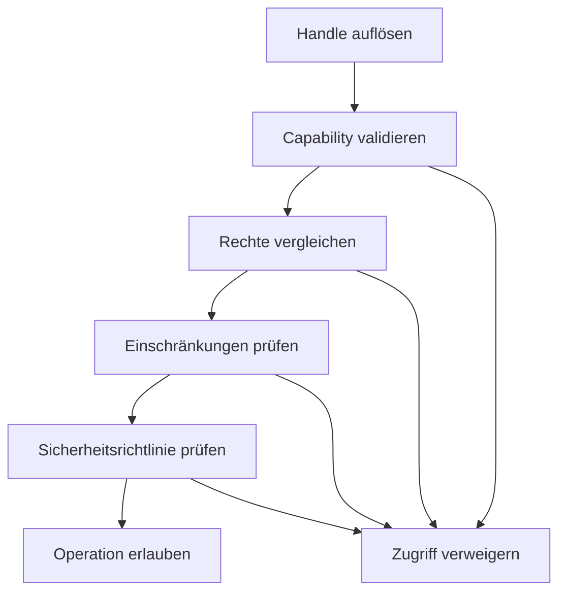
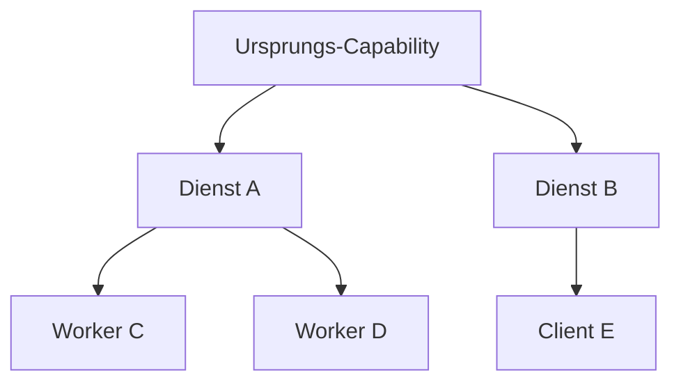

# NPSPEC-KERNEL-0103 – Capability Framework

| Feld | Wert |
|---|---|
| Dokument-ID | NPSPEC-KERNEL-0103 |
| Titel | Capability Framework |
| Status | Spezifikation |
| Version | 1.0 |
| Datum | 2026-08-03 |
| Bereich | Kernel / Security / Resource Management |
| Verantwortlich | NovaOS Architecture Team |
| Abhängigkeiten | NPSPEC-KERNEL-0012, NPSPEC-KERNEL-0013, NPSPEC-KERNEL-0020, NPSPEC-KERNEL-0100, NPSPEC-KERNEL-0102 |
| Zugehörige ADRs | ADR-KERNEL-0102, ADR-KERNEL-0103, ADR-SEC-0006 |

---

## 1. Zweck

Das Capability Framework definiert die einheitliche, objektbezogene Autorisierung innerhalb von NovaOS.

Eine Capability ist ein nicht fälschbarer Berechtigungsnachweis, der festlegt:

- auf welches Objekt zugegriffen werden darf,
- welche Operationen erlaubt sind,
- unter welchen Bedingungen der Zugriff gilt,
- ob die Berechtigung weitergegeben werden darf,
- wie lange die Berechtigung gültig bleibt.

Das Framework ersetzt globale, implizite Zugriffsrechte weitgehend durch explizite und möglichst eng begrenzte Berechtigungen.

---

## 2. Geltungsbereich

Das Capability Framework gilt für:

- Kernelobjekte
- Prozesse und Threads
- Speicherobjekte
- Dateien und Verzeichnisse
- Geräte und Treiber
- IPC-Endpunkte
- Netzwerkressourcen
- Systemdienste
- Kernelmodule
- Namespaces
- administrative Systemoperationen

Auch privilegierte Komponenten MÜSSEN grundsätzlich über definierte Capabilities arbeiten.

---

## 3. Entwurfsziele

Das Framework MUSS:

- das Prinzip der geringsten Rechte umsetzen,
- Rechte objektbezogen darstellen,
- nicht fälschbare Berechtigungen verwenden,
- Capability-Weitergabe kontrollieren,
- Rechteabschwächung unterstützen,
- zeitlich begrenzte Rechte ermöglichen,
- Rechte widerrufen können,
- Sicherheitsdomänen isolieren,
- Zugriffsentscheidungen auditierbar machen,
- schnelle Prüfungen im Kernel ermöglichen,
- mit Handles und der Unified Object API zusammenarbeiten.

---

## 4. Nichtziele

Das Framework ersetzt nicht vollständig:

- Benutzer- und Gruppenidentitäten,
- Sicherheitsdeskriptoren,
- Integritätsstufen,
- Mandatory Access Control,
- digitale Signaturen,
- Sandboxing,
- Prozessisolation,
- kryptografische Authentifizierung.

Capabilities bilden die operative Zugriffsberechtigung. Zusätzliche Sicherheitsrichtlinien können einen Zugriff trotz vorhandener Capability ablehnen.

---

## 5. Grundprinzip

Ein Zugriff wird nur erlaubt, wenn alle erforderlichen Bedingungen erfüllt sind:

```text
gültiges Handle
    UND gültige Capability
    UND passender Objekttyp
    UND erlaubte Operation
    UND gültiger Sicherheitskontext
    UND erfüllte Systemrichtlinie
    UND zulässiger Objektzustand
```

Der Besitz einer Objekt-ID allein verleiht keine Berechtigung.

---

## 6. Capability-Struktur

Kernelintern wird eine Capability durch einen geschützten Deskriptor repräsentiert.

```c
typedef struct nova_capability {
    nova_capability_id_t id;
    nova_object_id_t object_id;
    nova_capability_set_t rights;
    nova_capability_set_t delegable_rights;
    nova_security_domain_id_t owner_domain;
    nova_time_ns_t expiration;
    uint64_t generation;
    uint32_t flags;
    uint32_t policy_id;
} nova_capability_t;
```

Userspace-Prozesse erhalten keinen direkten Zugriff auf diese Struktur.

---

## 7. Capability-Identität

Jede Capability besitzt:

| Feld | Bedeutung |
|---|---|
| Capability-ID | Kernelweit eindeutige Kennung |
| Generation | Erkennt wiederverwendete Einträge |
| Objekt-ID | Zielobjekt der Berechtigung |
| Besitzer-Domäne | Aktuelle Sicherheitsdomäne |
| Rechte | Nutzbare Operationen |
| delegierbare Rechte | Weitergebbare Teilmenge |
| Ablaufzeit | Optionale zeitliche Begrenzung |
| Richtlinien-ID | Optionale Zusatzbedingungen |

Capability-IDs DÜRFEN nicht als Geheimnis oder alleiniger Sicherheitsmechanismus betrachtet werden.

---

## 8. Nichtfälschbarkeit

Capabilities MÜSSEN ausschließlich durch den Kernel oder einen autorisierten Sicherheitsdienst erzeugt werden.

Userspace darf:

- keine Capability-Strukturen erzeugen,
- keine Rechtebits erweitern,
- keine Objektbindung verändern,
- keine Generation manipulieren,
- keine Ablaufzeit verlängern.

Alle benutzerseitigen Referenzen werden über geschützte Handle-Tabellen aufgelöst.

---

## 9. Capability-Arten

Das Framework unterscheidet folgende Arten:

| Art | Bedeutung |
|---|---|
| Objekt-Capability | Zugriff auf ein konkretes Objekt |
| Typ-Capability | Erzeugung oder Verwaltung eines Objekttyps |
| Namespace-Capability | Zugriff innerhalb eines Namensraums |
| Service-Capability | Nutzung eines Kernel- oder Systemdienstes |
| Administrative Capability | Durchführung privilegierter Operationen |
| Delegations-Capability | Erlaubnis zur kontrollierten Weitergabe |
| Ambient Capability | Begrenztes, automatisch verfügbares Prozessrecht |
| Ephemeral Capability | Kurzlebige Berechtigung für eine Operation |

Ambient Capabilities SOLLEN nur verwendet werden, wenn eine explizite Objekt-Capability unpraktikabel ist.

---

## 10. Standardrechte

Die allgemeinen Objektrechte sind:

```c
typedef uint64_t nova_capability_set_t;

#define NOVA_CAP_OBJECT_QUERY       (1ull << 0)
#define NOVA_CAP_OBJECT_MODIFY      (1ull << 1)
#define NOVA_CAP_OBJECT_WAIT        (1ull << 2)
#define NOVA_CAP_OBJECT_SIGNAL      (1ull << 3)
#define NOVA_CAP_OBJECT_DUPLICATE   (1ull << 4)
#define NOVA_CAP_OBJECT_TRANSFER    (1ull << 5)
#define NOVA_CAP_OBJECT_SUBSCRIBE   (1ull << 6)
#define NOVA_CAP_OBJECT_DELETE      (1ull << 7)
#define NOVA_CAP_OBJECT_ADMIN       (1ull << 8)
```

Weitere Bits werden durch den jeweiligen Objekttyp definiert.

---

## 11. Typspezifische Rechte

Beispiele für typspezifische Capabilities:

| Objekttyp | Capability | Bedeutung |
|---|---|---|
| Prozess | `PROCESS_TERMINATE` | Prozess beenden |
| Prozess | `PROCESS_INSPECT` | Prozesszustand untersuchen |
| Thread | `THREAD_SUSPEND` | Thread anhalten |
| Speicher | `MEMORY_MAP` | Speicherobjekt einblenden |
| Speicher | `MEMORY_EXECUTE` | ausführbares Mapping erzeugen |
| Datei | `FILE_READ_DATA` | Dateidaten lesen |
| Datei | `FILE_WRITE_DATA` | Dateidaten verändern |
| Verzeichnis | `DIRECTORY_ENUMERATE` | Einträge auflisten |
| Gerät | `DEVICE_CONTROL` | Gerätesteuerbefehle senden |
| IPC | `IPC_SEND` | Nachricht senden |
| IPC | `IPC_RECEIVE` | Nachricht empfangen |
| Netzwerk | `NETWORK_BIND` | Endpunkt binden |
| Netzwerk | `NETWORK_CONNECT` | Verbindung herstellen |

Typspezifische Rechte MÜSSEN innerhalb des jeweiligen ABI-Bereichs stabil definiert werden.

---

## 12. Rechtehierarchie

Rechte dürfen Implikationen besitzen.

Beispiel:

```text
OBJECT_ADMIN
├── OBJECT_QUERY
├── OBJECT_MODIFY
├── OBJECT_SUBSCRIBE
└── OBJECT_DELETE
```

Solche Implikationen MÜSSEN explizit im Objekttyp registriert werden.

Die API darf nicht pauschal annehmen, dass ein administratives Recht sämtliche typspezifischen Operationen erlaubt.

---

## 13. Capability-Erzeugung

Neue Capabilities werden über eine kontrollierte Kerneloperation erzeugt.

```c
nova_status_t nova_capability_create(
    nova_handle_t object_handle,
    nova_capability_set_t requested_rights,
    const nova_capability_constraints_t *constraints,
    nova_handle_t *out_capability_handle
);
```

Die Erzeugung MUSS prüfen:

1. Gültigkeit des Zielobjekts,
2. Rechte des Aufrufers,
3. Sicherheitsrichtlinie des Objekts,
4. maximal erlaubte Rechte,
5. zulässige Delegationsrechte,
6. zeitliche und räumliche Einschränkungen.

---

## 14. Capability-Ableitung

Eine neue Capability kann aus einer bestehenden Capability abgeleitet werden.

```c
nova_status_t nova_capability_derive(
    nova_handle_t source_capability,
    nova_capability_set_t reduced_rights,
    const nova_capability_constraints_t *constraints,
    nova_handle_t *out_capability
);
```

Eine abgeleitete Capability darf niemals mehr Rechte oder weniger Einschränkungen als ihre Quelle besitzen.

---

## 15. Monotone Rechteabschwächung

Capability-Ableitungen folgen einer monotonen Abschwächung:

```text
Rechte_neu ⊆ Rechte_quelle
Delegierbare_Rechte_neu ⊆ Delegierbare_Rechte_quelle
Gültigkeitsdauer_neu ≤ Gültigkeitsdauer_quelle
Geltungsbereich_neu ⊆ Geltungsbereich_quelle
```

Eine Rechteerweiterung erfordert eine neue Autorisierungsentscheidung durch den Security Manager.

---

## 16. Einschränkungen

Eine Capability kann zusätzliche Einschränkungen enthalten:

| Einschränkung | Beispiel |
|---|---|
| Zeitlich | gültig bis zu einem festen Zeitpunkt |
| Prozessgebunden | nur in einem bestimmten Prozess nutzbar |
| Threadgebunden | nur durch einen bestimmten Thread nutzbar |
| Namespacegebunden | nur in einem Namespace gültig |
| Domänengebunden | nur in einer Sicherheitsdomäne gültig |
| Operationsgebunden | nur für eine bestimmte Methode |
| Mengenbegrenzt | maximal definierte Anzahl von Aufrufen |
| Ressourcenbegrenzt | maximaler Speicher- oder Datenumfang |
| Zustandsgebunden | nur in bestimmten Objektzuständen gültig |

Mehrere Einschränkungen werden standardmäßig mit logischem UND verknüpft.

---

## 17. Capability-Handles

Im Userspace werden Capabilities durch Handles dargestellt.

```c
typedef uint64_t nova_handle_t;
```

Ein Capability-Handle enthält mindestens logisch:

- Handle-Index
- Handle-Generation
- Handle-Klasse
- Tabellenkennung

Die konkrete Bitaufteilung bleibt eine interne Kernelimplementierung.

---

## 18. Gebundene Objekt-Handles

Ein reguläres Objekt-Handle kann die zugehörigen Capability-Rechte direkt enthalten.

```text
Objekt-Handle
├── Zielobjekt
├── Capability-Rechte
├── Handle-Flags
├── Sicherheitsdomäne
└── Generation
```

Dadurch ist für normale Zugriffe kein separates Capability-Handle erforderlich.

Separate Capability-Handles werden für Delegation, Speicherung oder erweiterte Richtlinien verwendet.

---

## 19. Zugriffsprüfung

Die zentrale Zugriffsprüfung erfolgt über:

```c
nova_status_t nova_capability_check(
    nova_security_context_t *subject,
    nova_object_t *object,
    nova_capability_set_t required_rights,
    const nova_operation_context_t *operation
);
```

Die Prüfung MUSS fail-closed arbeiten.

Unbekannte Rechte, beschädigte Metadaten oder nicht auswertbare Richtlinien führen zur Ablehnung.

---

## 20. Prüfablauf



Fehlerdetails dürfen nur soweit zurückgegeben werden, wie dies keine geschützten Informationen offenlegt.

---

## 21. Delegation

Capabilities können kontrolliert an andere Prozesse oder Sicherheitsdomänen delegiert werden.

```c
nova_status_t nova_capability_delegate(
    nova_handle_t source_capability,
    nova_handle_t target_process,
    nova_capability_set_t delegated_rights,
    const nova_capability_constraints_t *constraints,
    nova_handle_t *out_target_handle
);
```

Delegation ist nur erlaubt, wenn:

- die Quelle delegierbar ist,
- der Aufrufer das Delegationsrecht besitzt,
- die Zielrechte nicht größer als die delegierbaren Rechte sind,
- die Zielrichtlinie den Empfang erlaubt,
- keine Isolationsgrenze verletzt wird.

---

## 22. Capability-Übertragung über IPC

IPC-Nachrichten dürfen Capability-Anhänge enthalten.

```c
typedef struct nova_ipc_capability_attachment {
    nova_handle_t source_handle;
    nova_capability_set_t transferred_rights;
    uint32_t flags;
} nova_ipc_capability_attachment_t;
```

Die Übertragung MUSS atomar mit der Nachrichtenannahme erfolgen.

Schlägt die Übertragung fehl, darf beim Empfänger keine teilweise erzeugte Berechtigung verbleiben.

---

## 23. Copy- und Move-Semantik

Capability-Übertragungen können zwei Semantiken verwenden:

| Semantik | Verhalten |
|---|---|
| Copy | Sender behält seine Capability |
| Move | Capability wird beim Sender entfernt |
| Derive | Empfänger erhält abgeschwächte Ableitung |
| Borrow | Empfänger erhält temporäre, nicht delegierbare Berechtigung |

Die gewünschte Semantik MUSS explizit angegeben werden.

---

## 24. Capability Borrowing

Borrowed Capabilities sind kurzlebige Berechtigungen für einen begrenzten Aufrufkontext.

Sie MÜSSEN:

- eine klar definierte Lebensdauer besitzen,
- nicht dauerhaft gespeichert werden können,
- nicht weiterdelegierbar sein,
- beim Ende der Operation automatisch ungültig werden.

Borrowing eignet sich insbesondere für synchrone RPC-Aufrufe.

---

## 25. Widerruf

Eine Capability kann durch den Besitzer, das Zielobjekt oder eine autorisierte Sicherheitsinstanz widerrufen werden.

```c
nova_status_t nova_capability_revoke(
    nova_handle_t capability_handle,
    nova_revoke_scope_t scope,
    uint32_t flags
);
```

Mögliche Widerrufsumfänge:

- nur diese Capability,
- alle direkten Ableitungen,
- vollständiger Ableitungsbaum,
- alle Capabilities für ein Objekt,
- alle Capabilities einer Sicherheitsdomäne.

---

## 26. Widerrufsmodell

Capabilities bilden einen Ableitungsgraphen.



Beim rekursiven Widerruf von `Dienst A` werden auch die Capabilities von `Worker C` und `Worker D` ungültig.

---

## 27. Lazy Revocation

Für hohe Skalierbarkeit darf ein Widerruf zunächst logisch erfolgen.

Dazu werden verwendet:

- Widerrufsgenerationen,
- Revocation Tokens,
- Objekt-Epochen,
- Domänen-Epochen.

Spätestens beim nächsten geschützten Zugriff MUSS die Ungültigkeit erkannt werden.

---

## 28. Sofortiger Widerruf

Für besonders sensible Rechte MUSS ein synchroner Widerruf möglich sein.

Dazu gehören beispielsweise:

- Zugriff auf kryptografische Schlüssel,
- Debug-Zugriffe,
- Kernelmodulverwaltung,
- ausführbare Speichermappings,
- Gerätekontrolle,
- Sicherheitsrichtlinienänderungen.

Der synchrone Widerruf darf laufende Operationen kontrolliert abbrechen oder bis zu einem sicheren Punkt warten.

---

## 29. Ablaufzeit

Capabilities können zeitlich begrenzt sein.

```c
typedef struct nova_capability_constraints {
    uint32_t size;
    uint32_t version;
    nova_time_ns_t not_before;
    nova_time_ns_t expires_at;
    uint64_t maximum_uses;
    uint32_t flags;
} nova_capability_constraints_t;
```

Zeitprüfungen MÜSSEN auf einer monotonen Kernelzeit basieren, sofern keine reale Kalenderzeit erforderlich ist.

---

## 30. Nutzungsbegrenzung

Eine Capability darf eine maximale Nutzungsanzahl besitzen.

Mögliche Anwendungen:

- einmalige Token,
- begrenzte Entschlüsselungsoperationen,
- temporäre Gerätesteuerung,
- einmalige IPC-Antwortrechte,
- eingeschränkte Recovery-Operationen.

Die Aktualisierung des Nutzungszählers MUSS atomar erfolgen.

---

## 31. Vererbung bei Prozesserzeugung

Capabilities werden nicht automatisch vollständig an Kindprozesse vererbt.

Jedes Handle besitzt ein Vererbungsflag.

```c
#define NOVA_HANDLE_INHERITABLE       (1u << 0)
#define NOVA_HANDLE_CLOSE_ON_EXEC     (1u << 1)
#define NOVA_HANDLE_NO_DELEGATE       (1u << 2)
```

Beim Start eines neuen Programms SOLLEN nur explizit freigegebene Capabilities übertragen werden.

---

## 32. Start-Capabilities

Ein neuer Prozess erhält eine definierte Startmenge an Capabilities.

Diese kann enthalten:

- Zugriff auf den eigenen Prozess,
- Zugriff auf eigene Threads,
- Standard-Ein- und -Ausgabe,
- ausgewählte IPC-Endpunkte,
- Programmbild und Bibliotheken,
- begrenzten Dateisystem-Namespace,
- benötigte Systemdienste.

Der Prozess erhält keine allgemeinen administrativen Rechte, sofern diese nicht ausdrücklich vorgesehen sind.

---

## 33. Manifestbasierte Rechte

Programme können benötigte Capabilities in einem signierten oder vertrauenswürdig installierten Manifest deklarieren.

Beispiel:

```yaml
capabilities:
  filesystem:
    - path: "/user/documents"
      rights: [read, write]
  network:
    outbound: true
    listen: false
  devices:
    camera: prompt
    microphone: deny
```

Ein Manifest ist eine Anforderung und keine automatische Berechtigung.

Die tatsächliche Erteilung erfolgt durch Systemrichtlinie, Benutzerentscheidung oder einen autorisierten Systemdienst.

---

## 34. Benutzerentscheidungen

Benutzerabhängige Capability-Freigaben MÜSSEN:

- den anfordernden Prozess eindeutig anzeigen,
- den Zweck verständlich beschreiben,
- den Umfang der Ressource nennen,
- eine Ablehnung ermöglichen,
- zeitlich begrenzte Freigaben unterstützen,
- später widerrufbar sein.

Kernel und Security Manager stellen die technische Durchsetzung bereit. Die grafische Darstellung übernimmt ein vertrauenswürdiger Systemdienst.

---

## 35. Systemdienste

Systemdienste erhalten ausschließlich die für ihre Aufgabe notwendigen Capabilities.

Beispiel:

| Dienst | Typische Rechte |
|---|---|
| Audiodienst | Zugriff auf Audiogeräte und Client-IPC |
| Netzwerkdienst | Verwaltung definierter Netzwerkobjekte |
| Dateiauswahldienst | temporäre Dateizugriffe |
| Druckdienst | Zugriff auf Druckgeräte und Spool-Verzeichnis |
| Update-Dienst | Zugriff auf signierte Systemgenerationen |
| Diagnosedienst | lesender Zugriff auf freigegebene Telemetrie |

Ein kompromittierter Dienst soll dadurch nur einen begrenzten Teil des Systems erreichen können.

---

## 36. Treiber und Geräte

Treiber erhalten Capability-basierte Zugriffe auf:

- zugeordnete Geräte,
- MMIO-Bereiche,
- I/O-Ports,
- Interrupts,
- DMA-Domänen,
- Firmwareobjekte,
- Treiber-IPC.

Ein Treiber darf nicht auf fremde Geräte oder physische Speicherbereiche zugreifen, sofern keine zusätzliche Capability erteilt wurde.

---

## 37. Speichercapabilities

Speichercapabilities unterscheiden mindestens:

- Lesen
- Schreiben
- Mapping
- Ausführen
- Teilen
- Sperren
- physische Adressabfrage
- DMA-Nutzung

Schreibbare und ausführbare Rechte SOLLEN nicht gleichzeitig vergeben werden.

Die Umwandlung eines schreibbaren in ein ausführbares Mapping erfordert eine gesonderte Prüfung.

---

## 38. Dateisystemcapabilities

Dateisystemzugriffe können an konkrete Objekte statt ausschließlich an Pfade gebunden werden.

Eine Datei-Capability bleibt an dasselbe Dateiobjekt gebunden, auch wenn:

- die Datei umbenannt wird,
- sich ihr Pfad ändert,
- ein Namespace an anderer Stelle eingebunden wird.

Sicherheitsrichtlinien können den Zugriff dennoch bei Löschung, Widerruf oder Namespace-Wechsel einschränken.

---

## 39. Netzwerkkapabilities

Netzwerkrechte können begrenzt werden auf:

- Protokoll
- lokale Adresse
- Zieladresse
- Portbereich
- Netzwerkschnittstelle
- Routing-Domäne
- eingehende oder ausgehende Verbindungen
- Bandbreitenklasse

Eine allgemeine Netzwerk-Capability SOLLTE normalen Anwendungen nicht standardmäßig erteilt werden.

---

## 40. Administrative Capabilities

Administrative Capabilities werden fein aufgeteilt.

Beispiele:

```c
NOVA_CAP_SYSTEM_POWER
NOVA_CAP_SYSTEM_TIME_SET
NOVA_CAP_MODULE_LOAD
NOVA_CAP_MODULE_UNLOAD
NOVA_CAP_PROCESS_DEBUG
NOVA_CAP_SECURITY_POLICY
NOVA_CAP_DEVICE_ADMIN
NOVA_CAP_NETWORK_ADMIN
NOVA_CAP_AUDIT_READ
NOVA_CAP_AUDIT_CONTROL
```

Eine einzelne globale Superuser-Capability SOLL vermieden werden.

---

## 41. Kernelinterne Capabilities

Auch Kernelmodule und Subsysteme können durch Capability-Sets eingeschränkt werden.

Ein geladenes Modul erhält nur Zugriff auf:

- deklarierte Kernelservices,
- freigegebene Objekttypen,
- zugewiesene Geräte,
- definierte Event-Klassen,
- erlaubte Speicheroperationen.

Dies reduziert unbeabsichtigte Abhängigkeiten, ersetzt bei Kernelcode jedoch keine Speichersicherheit.

---

## 42. Notfall- und Recovery-Capabilities

Verified Recovery darf spezielle Recovery-Capabilities erhalten.

Diese Capabilities MÜSSEN:

- nur im verifizierten Recovery-Modus gültig sein,
- an die aktive Boot- und Trust-Umgebung gebunden sein,
- klar definierte Systemressourcen betreffen,
- vollständig auditiert werden,
- nach Verlassen des Recovery-Modus automatisch verfallen.

Ein TPM ist dafür optional und darf nicht zwingend vorausgesetzt werden.

---

## 43. Trust-Backend-Integration

Capability-Entscheidungen können optional an ein Trust Backend gebunden werden.

Mögliche Backends:

- TPM
- Firmware Trust Store
- Secure Element
- signierte Software-Schlüssel
- passwortbasierte Recovery-Autorisierung
- rein softwarebasierter Vertrauensspeicher

Fehlt ein Hardware-Trust-Backend, MUSS das System den reduzierten Schutzstatus ehrlich anzeigen.

---

## 44. Sicherheitsdomänen

Jeder Prozess gehört mindestens einer Sicherheitsdomäne an.

Domänen können repräsentieren:

- Benutzer
- Anwendung
- Container
- Systemdienst
- Treiber
- Recovery-Umgebung
- Kompatibilitätssubsystem

Capability-Übertragungen zwischen Domänen erfordern eine explizite Prüfung.

---

## 45. Domänenwechsel

Ein Prozess darf seine Sicherheitsdomäne nicht selbstständig erweitern oder wechseln.

Ein kontrollierter Wechsel benötigt:

- eine entsprechende Capability,
- eine autorisierte Zielrichtlinie,
- einen vertrauenswürdigen Vermittlungsdienst,
- eine Auditaufzeichnung,
- gegebenenfalls eine Benutzerbestätigung.

Bestehende Capabilities werden beim Wechsel neu bewertet oder entfernt.

---

## 46. Confused-Deputy-Schutz

Dienste müssen unterscheiden, ob sie:

- mit eigenen Rechten,
- mit delegierten Client-Rechten,
- mit einer Kombination aus beiden

arbeiten.

Standardmäßig SOLL ein Dienst bei clientbezogenen Operationen die delegierte Client-Capability verwenden.

Dadurch wird verhindert, dass ein weniger privilegierter Client die erweiterten Rechte eines Dienstes missbraucht.

---

## 47. Capability-Sealing

Capabilities können versiegelt werden.

Eine versiegelte Capability:

- kann gespeichert oder transportiert werden,
- ist nicht direkt ausführbar,
- kann nur durch einen bestimmten Dienst oder Objekttyp geöffnet werden,
- kann an eine Sicherheitsdomäne oder Systemgeneration gebunden sein.

```c
nova_status_t nova_capability_seal(
    nova_handle_t capability,
    nova_handle_t sealing_authority,
    nova_handle_t *out_sealed_object
);
```

---

## 48. Capability-Unsealing

```c
nova_status_t nova_capability_unseal(
    nova_handle_t sealed_object,
    nova_handle_t unsealing_authority,
    nova_handle_t *out_capability
);
```

Das Öffnen MUSS sämtliche Bindungen und den aktuellen Sicherheitszustand erneut prüfen.

Versiegelte Capabilities dürfen keine Möglichkeit zur Umgehung eines späteren Widerrufs darstellen.

---

## 49. Persistenz

Normale Capability-Handles sind nicht über einen Neustart hinweg gültig.

Persistente Berechtigungen werden stattdessen als Richtlinie oder versiegeltes Autorisierungsobjekt gespeichert.

Beim Systemstart werden daraus neue Laufzeit-Capabilities erzeugt.

Persistente Berechtigungen MÜSSEN an mindestens folgende Informationen gebunden werden:

- Zielobjekt oder stabile Ressourcenidentität
- Sicherheitsdomäne
- erlaubte Rechte
- Systemrichtlinie
- optional Systemgeneration und Trust-Zustand

---

## 50. Capability-Gruppen

Mehrere Capabilities können in einem Capability Set zusammengefasst werden.

```c
nova_status_t nova_capability_set_create(
    const nova_handle_t *capabilities,
    size_t capability_count,
    uint32_t flags,
    nova_handle_t *out_set
);
```

Ein Capability Set ist selbst ein Kernelobjekt und kann eingeschränkt, übertragen und widerrufen werden.

---

## 51. Atomare Übergabe

Beim Prozessstart oder bei komplexen IPC-Aufrufen kann eine Gruppe von Capabilities atomar übertragen werden.

Dabei gilt:

- entweder werden alle Capabilities übertragen,
- oder keine Capability wird sichtbar,
- alle Berechtigungen werden vor dem Commit geprüft,
- Fehler führen zu einem vollständigen Rollback.

---

## 52. Event-Bus-Integration

Das Capability Framework veröffentlicht sicherheitsrelevante Ereignisse über den Event Bus.

Mögliche Ereignisse:

| Ereignis | Bedeutung |
|---|---|
| `CAPABILITY_CREATED` | Capability wurde erzeugt |
| `CAPABILITY_DERIVED` | Capability wurde abgeschwächt abgeleitet |
| `CAPABILITY_DELEGATED` | Capability wurde übertragen |
| `CAPABILITY_REVOKED` | Capability wurde widerrufen |
| `CAPABILITY_EXPIRED` | Gültigkeitszeit ist abgelaufen |
| `CAPABILITY_DENIED` | Zugriff wurde verweigert |
| `CAPABILITY_VIOLATION` | Manipulations- oder Missbrauchsversuch erkannt |

Ereignisse MÜSSEN sensitive Objektinformationen entsprechend der Empfängerrechte filtern.

---

## 53. Kernel Object Graph

Capabilities werden im Kernel Object Graph als Beziehungen oder eigene Sicherheitsobjekte abgebildet.

Beispiele:

```text
Process A --HOLDS--> Capability X
Capability X --GRANTS--> Device D
Capability X --DERIVED_FROM--> Capability Y
Security Domain B --OWNS--> Capability Y
```

Der Graph darf für Diagnose und Widerruf verwendet werden.

Die Zugriffsentscheidung darf jedoch nicht ausschließlich auf einer ungeschützten Graphabfrage beruhen.

---

## 54. Auditierung

Folgende Vorgänge MÜSSEN oder SOLLEN auditiert werden:

| Vorgang | Anforderung |
|---|---|
| Administrative Capability erzeugt | MUSS |
| Capability domänenübergreifend delegiert | MUSS |
| Rechteerweiterung angefordert | MUSS |
| Capability widerrufen | MUSS |
| Versiegelte Capability geöffnet | MUSS |
| Normaler Objektzugriff erlaubt | optional |
| Normaler Objektzugriff verweigert | richtlinienabhängig |
| Wiederholter ungültiger Zugriff | MUSS |

Auditdaten dürfen keine kryptografischen Schlüssel oder vollständigen IPC-Nutzdaten enthalten.

---

## 55. Datenschutz

Capability-Metadaten können Rückschlüsse auf Benutzeraktivitäten erlauben.

Daher gilt:

- Diagnoseinformationen sind zugriffsbeschränkt.
- Objektbezeichnungen werden bei fehlenden Rechten maskiert.
- Protokolle werden lokal gespeichert.
- Externe Übertragung ist standardmäßig deaktiviert.
- Aufbewahrungsfristen müssen konfigurierbar sein.
- Sensitive Capability-Graphen dürfen nicht unkontrolliert exportiert werden.

---

## 56. Cache für Zugriffsentscheidungen

Häufige Zugriffsentscheidungen dürfen gecacht werden.

Ein Cache-Eintrag MUSS mindestens gebunden sein an:

- Capability-ID und Generation
- Objekt-ID und Generation
- Sicherheitsdomäne
- angeforderte Rechte
- Richtliniengeneration
- Widerrufsepoche

Ändert sich eine dieser Grundlagen, wird der Cache-Eintrag ungültig.

---

## 57. Nebenläufigkeit

Das Framework MUSS parallele Zugriffsprüfungen auf mehreren CPUs unterstützen.

Dabei gelten folgende Anforderungen:

- häufige Prüfungen benötigen keine globale Sperre,
- Capability-Tabellen werden geshardet oder pro Prozess verwaltet,
- Generationen werden atomar geprüft,
- Widerruf und Ableitung sind serialisierbar,
- Nutzungszähler werden atomar aktualisiert,
- Destruktion erfolgt erst nach Abschluss geschützter Leser.

---

## 58. RCU-Unterstützung

Read-Copy-Update darf für leselastige Capability-Tabellen eingesetzt werden.

Widerrufene Capabilities werden logisch sofort ungültig, ihr Speicher kann jedoch erst nach einer Grace Period freigegeben werden.

Neue Zugriffe MÜSSEN den Widerruf bereits vor der physischen Freigabe erkennen.

---

## 59. Ressourcenlimits

Das System MUSS Limits unterstützen für:

- Capabilities pro Prozess
- Capabilities pro Sicherheitsdomäne
- Ableitungstiefe
- Delegationen pro Operation
- Capability-Anhänge pro IPC-Nachricht
- versiegelte Capabilities
- ausstehende Widerrufe
- Capability Sets
- Auditereignisse

Limitüberschreitungen dürfen nicht zur Umgehung bestehender Sicherheitsrichtlinien führen.

---

## 60. Fehlercodes

| Status | Bedeutung |
|---|---|
| `NOVA_STATUS_SUCCESS` | Operation erfolgreich |
| `NOVA_STATUS_INVALID_CAPABILITY` | Capability ist ungültig |
| `NOVA_STATUS_CAPABILITY_REVOKED` | Capability wurde widerrufen |
| `NOVA_STATUS_CAPABILITY_EXPIRED` | Capability ist abgelaufen |
| `NOVA_STATUS_CAPABILITY_EXHAUSTED` | Nutzungsbegrenzung wurde erreicht |
| `NOVA_STATUS_RIGHTS_MISSING` | Benötigte Rechte fehlen |
| `NOVA_STATUS_DELEGATION_DENIED` | Weitergabe ist nicht erlaubt |
| `NOVA_STATUS_DOMAIN_MISMATCH` | Sicherheitsdomäne stimmt nicht überein |
| `NOVA_STATUS_POLICY_DENIED` | Zusätzliche Richtlinie verweigert Zugriff |
| `NOVA_STATUS_STALE_REFERENCE` | Generation ist veraltet |
| `NOVA_STATUS_LIMIT_REACHED` | Ressourcenlimit wurde erreicht |
| `NOVA_STATUS_CONFLICT` | Capability-Zustand wurde parallel verändert |

---

## 61. Diagnose

Ein autorisierter Diagnosedienst darf folgende Informationen abfragen:

- Capability-ID
- Objekt-ID
- Rechte und delegierbare Rechte
- Besitzer-Domäne
- Erzeugungszeit
- Ablaufzeit
- Widerrufsstatus
- Ableitungsbeziehungen
- Nutzungszähler
- letzte Zugriffsentscheidung
- zugehörige Handles

Objektnamen und sensitive Attribute werden entsprechend den Diagnose-Capabilities maskiert.

---

## 62. Statistiken

Das Framework SOLL mindestens folgende Statistiken führen:

- aktive Capabilities
- Capabilities pro Typ
- Erzeugungen und Ableitungen
- Delegationen
- Widerrufe
- abgelaufene Capabilities
- verweigerte Zugriffe
- Cache-Treffer und Cache-Fehler
- maximale Ableitungstiefe
- domänenübergreifende Übertragungen
- durchschnittliche Prüfzeit

Statistiken dürfen standardmäßig keine personenbezogenen Inhalte enthalten.

---

## 63. Performance-Anforderungen

Für den normalen Objektzugriff gelten folgende Ziele:

- Capability-Prüfung ohne dynamische Speicherallokation,
- keine globale Sperre im Fast Path,
- konstante Handle-Auflösung,
- konstante Prüfung einfacher Rechtebits,
- verzögerte Auditverarbeitung, sofern sicher zulässig,
- per-CPU-Caches für häufige Richtlinienentscheidungen.

Widerrufssicherheit und korrekte Autorisierung haben Vorrang vor Cache-Optimierungen.

---

## 64. Early-Boot-Modus

Während des frühen Bootvorgangs steht ein eingeschränktes Capability-Modell zur Verfügung.

Es umfasst:

- statische Boot-Capabilities,
- Kernel-intern registrierte Sicherheitsdomänen,
- Zugriff auf Boot-Handoff-Objekte,
- kontrollierten Zugriff auf frühe Geräte,
- noch keine allgemeine Userspace-Delegation.

Beim Start des vollständigen Security Managers werden frühe Capabilities übernommen, ersetzt oder widerrufen.

---

## 65. Shutdown-Modus

Beim Herunterfahren:

- werden neue nicht essenzielle Delegationen abgelehnt,
- verfallen temporäre Capabilities,
- werden Systemdienste kontrolliert entprivilegiert,
- werden sensible Geräte- und Schlüsselfreigaben widerrufen,
- werden relevante Auditdaten abgeschlossen,
- werden persistente Richtlinien sicher gespeichert.

Capability-Handles werden nicht über den Neustart hinweg erhalten.

---

## 66. Panic-Modus

Im Panic-Kontext ist nur eine minimale Diagnosefunktion verfügbar.

Zulässig sind:

- lockfreie Prüfung vorbereiteter Capability-Metadaten,
- Ausgabe von IDs, Generationen und Rechtebits,
- Ermittlung des Widerrufsstatus,
- Übernahme begrenzter Informationen in den Crash Dump.

Normale Delegation, Ableitung und Capability-Erzeugung sind im Panic-Kontext unzulässig.

---

## 67. Testanforderungen

Die Implementierung MUSS mindestens folgende Tests enthalten:

- gültige und ungültige Capability-Prüfungen
- Rechteabschwächung
- versuchte Rechteerweiterung
- Capability-Delegation
- Copy-, Move-, Derive- und Borrow-Semantik
- domänenübergreifende Übergabe
- Ablaufzeit und Nutzungsbegrenzung
- einfacher und rekursiver Widerruf
- Widerruf während paralleler Nutzung
- Prozessvererbung
- Namespace-Isolation
- Capability-Anhänge über IPC
- Capability-Sealing
- Ressourcenlimitüberschreitungen
- manipulierte Handle- und Generationseinträge
- Cache-Invalidierung nach Richtlinienänderung

---

## 68. Sicherheitstests

Zusätzliche Sicherheitstests MÜSSEN prüfen:

- Capability-Fälschungsversuche
- Use-after-revoke
- Use-after-free
- Generation-Wraparound
- Confused-Deputy-Angriffe
- unzulässige Delegationsketten
- Capability-Leaks bei Prozessabstürzen
- Race Conditions zwischen Nutzung und Widerruf
- Rechteausweitung durch ABI-Manipulation
- unzulässige Capability-Vererbung
- Cross-Namespace- und Cross-Domain-Angriffe

---

## 69. Fuzzing

Folgende Eingaben SOLLEN kontinuierlich gefuzzt werden:

- Capability-Handles
- Rechtebitmasken
- Einschränkungsstrukturen
- IPC-Capability-Anhänge
- Ableitungsgraphen
- Widerrufsanforderungen
- Versions- und Größenfelder
- Manifestberechtigungen
- versiegelte Capability-Daten
- ungültige Zustandsübergänge

Das Fuzzing muss in isolierten Sicherheitsdomänen ausgeführt werden.

---

## 70. Verbindliche Invarianten

1. Eine Capability kann ausschließlich durch eine autorisierte Kerneloperation erzeugt werden.
2. Eine abgeleitete Capability besitzt niemals mehr Rechte als ihre Quelle.
3. Nicht delegierbare Rechte können nicht übertragen werden.
4. Eine widerrufene Capability erlaubt keine neuen Operationen.
5. Eine abgelaufene Capability wird wie eine ungültige Capability behandelt.
6. Ein Handle allein kann keine Rechte über die zugehörige Capability hinaus gewähren.
7. Eine Objekt-ID verleiht keine Zugriffsberechtigung.
8. Capability-Generationen verhindern die Nutzung wiederverwendeter Einträge.
9. Domänenwechsel führen zu einer erneuten Bewertung bestehender Capabilities.
10. Capability-Übertragungen über IPC sind atomar.
11. Borrowed Capabilities können nicht dauerhaft gespeichert oder weiterdelegiert werden.
12. Persistente Berechtigungen werden nach einem Neustart neu autorisiert.
13. Cache-Einträge werden nach Widerruf oder Richtlinienänderung ungültig.
14. Unbekannte Rechte und Richtlinien führen zur Ablehnung.
15. Administrative Rechte werden nicht als einzelne universelle Superuser-Capability modelliert.

---

## 71. Referenzablauf: Capability ableiten

```c
nova_capability_constraints_t constraints = {
    .size = sizeof(constraints),
    .version = 1,
    .expires_at = expiration_time,
    .maximum_uses = 100,
    .flags = NOVA_CAPABILITY_NO_DELEGATE
};

nova_handle_t derived_capability;

nova_status_t status = nova_capability_derive(
    source_capability,
    NOVA_CAP_FILE_READ_DATA |
    NOVA_CAP_OBJECT_QUERY,
    &constraints,
    &derived_capability
);

if (NOVA_FAILED(status)) {
    return status;
}
```

---

## 72. Referenzablauf: IPC-Delegation

```c
nova_ipc_capability_attachment_t attachment = {
    .source_handle = file_handle,
    .transferred_rights =
        NOVA_CAP_FILE_READ_DATA |
        NOVA_CAP_OBJECT_QUERY,
    .flags = NOVA_CAP_TRANSFER_DERIVE
};

nova_status_t status = nova_ipc_send(
    service_endpoint,
    &request,
    sizeof(request),
    &attachment,
    1
);
```

Der Empfänger erhält ausschließlich ein abgeschwächtes Handle für lesenden Zugriff.

---

## 73. Referenzablauf: Zugriffsentscheidung

```c
nova_status_t nova_file_read(
    nova_handle_t file_handle,
    void *buffer,
    size_t size,
    size_t *out_read
) {
    nova_object_t *object = NULL;

    nova_status_t status = nova_object_from_handle(
        file_handle,
        NOVA_TYPE_FILE,
        NOVA_CAP_FILE_READ_DATA,
        &object
    );

    if (NOVA_FAILED(status)) {
        return status;
    }

    status = nova_capability_check(
        nova_current_security_context(),
        object,
        NOVA_CAP_FILE_READ_DATA,
        NULL
    );

    if (NOVA_SUCCEEDED(status)) {
        status = nova_vfs_read_file(
            NOVA_OBJECT_CAST(nova_file_t, object),
            buffer,
            size,
            out_read
        );
    }

    nova_object_release(object);
    return status;
}
```

---

## 74. Implementierungsphasen

### Phase 1

- Capability-Basisstruktur
- Rechtebitmasken
- Handle-Integration
- zentrale Zugriffsprüfung
- einfache Ableitung

### Phase 2

- IPC-Delegation
- Sicherheitsdomänen
- zeitliche Einschränkungen
- Capability-Widerruf
- Audit-Integration

### Phase 3

- Capability Sets
- rekursiver Widerruf
- Borrowing
- Sealing
- Richtlinien-Cache

### Phase 4

- manifestbasierte Rechte
- Trust-Backend-Integration
- persistente Autorisierungsobjekte
- formale Prüfung der Sicherheitsinvarianten
- NUMA- und SMP-Optimierung

---

## 75. Zusammenfassung

Das Capability Framework stellt die zentrale objektbezogene Autorisierung von NovaOS bereit.

Es ermöglicht:

- explizite und minimale Zugriffsrechte,
- sichere Rechteabschwächung,
- kontrollierte Delegation,
- domänenübergreifende Isolation,
- zeitlich und mengenmäßig begrenzte Berechtigungen,
- widerrufbare Zugriffe,
- sichere Capability-Übertragung über IPC,
- Integration mit Handles, Objektmodell und Kernel Object Graph,
- nachvollziehbare Audit- und Diagnosefunktionen.

Damit bildet das Framework die Grundlage für ein System, in dem Prozesse, Dienste, Treiber und Kernelkomponenten nur auf die Ressourcen zugreifen können, die sie für ihre konkrete Aufgabe tatsächlich benötigen.