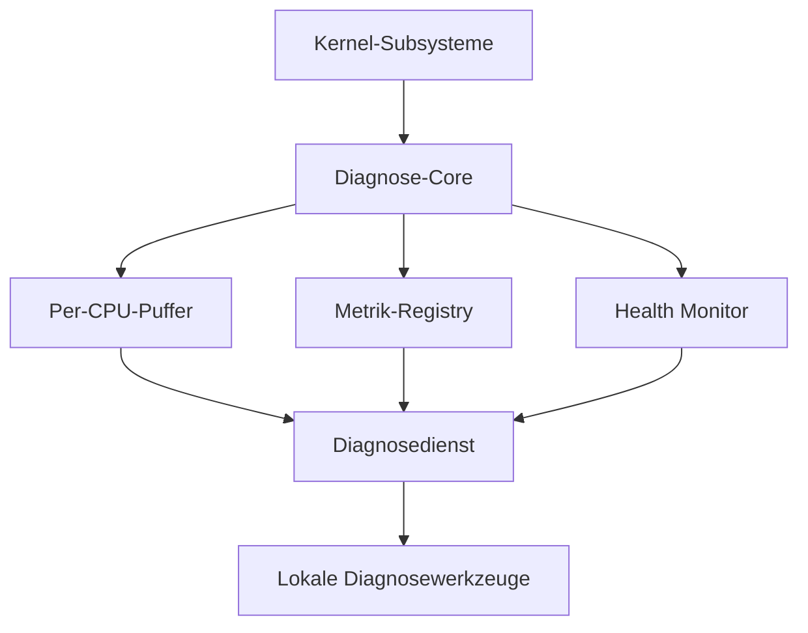

# NPSPEC-KERNEL-0104 – Kernel Diagnostics Framework

| Feld | Wert |
|---|---|
| Dokument-ID | NPSPEC-KERNEL-0104 |
| Titel | Kernel Diagnostics Framework |
| Status | Spezifikation |
| Version | 1.0 |
| Datum | 2026-08-03 |
| Bereich | Kernel / Diagnostics / Observability |
| Verantwortlich | NovaOS Architecture Team |
| Abhängigkeiten | NPSPEC-KERNEL-0023, NPSPEC-KERNEL-0024, NPSPEC-KERNEL-0100, NPSPEC-KERNEL-0101, NPSPEC-KERNEL-0102, NPSPEC-KERNEL-0103 |
| Zugehörige ADRs | ADR-KERNEL-0104, ADR-DIAG-0001, ADR-DIAG-0002, ADR-DIAG-0003, ADR-DIAG-0004, ADR-DIAG-0005, ADR-DIAG-0006, ADR-SEC-0008 |

---

## 1. Zweck

Das Kernel Diagnostics Framework stellt eine einheitliche Infrastruktur für Diagnose, Überwachung, Fehleranalyse und Leistungsbewertung des NovaOS-Kernels bereit.

Es vereinheitlicht:

- Kernel-Logging
- strukturiertes Tracing
- Performance Counter
- Kernelmetriken
- Objektinspektion
- Ereignisverfolgung
- Health Monitoring
- Assertions
- Crash-Kontext-Erfassung
- lokale Diagnoseabfragen

Das Framework soll Fehler sichtbar machen, ohne Stabilität, Sicherheit oder Datenschutz des Systems zu gefährden.

---

## 2. Geltungsbereich

Die Spezifikation gilt für:

- Kernel-Core
- Scheduler
- Process und Thread Manager
- Speicherverwaltung
- Interrupt- und Exception Manager
- IPC
- Device Manager
- Driver Framework
- Virtual File System
- Netzwerk-Stack
- Security Manager
- Power Manager
- Module Loader
- Kernel Object Graph
- Event Bus
- Capability Framework

Userspace-Diagnosewerkzeuge verwenden kontrollierte Kernel-Schnittstellen und erhalten keinen direkten Zugriff auf interne Speicherstrukturen.

---

## 3. Entwurfsziele

Das Framework MUSS:

- strukturierte Diagnosedaten bereitstellen,
- im Normalbetrieb geringe Kosten verursachen,
- SMP- und NUMA-fähig sein,
- dynamisch konfigurierbare Diagnosequellen unterstützen,
- sensible Informationen schützen,
- ohne externe Cloud-Dienste funktionieren,
- im Early-Boot- und Panic-Kontext eingeschränkt verfügbar sein,
- Diagnoseinformationen versionieren,
- Datenverluste transparent anzeigen,
- mit Kernel Object Graph und Event Bus zusammenarbeiten.

---

## 4. Nichtziele

Das Framework ist nicht:

- ein vollständiger Userspace-Debugger,
- ein Ersatz für das Crash Dump System,
- eine permanente Aufzeichnung sämtlicher Systemaktivitäten,
- eine Cloud-Telemetrieplattform,
- ein Ersatz für Sicherheits-Auditing,
- eine Garantie für verlustfreies Tracing unter jeder Last.

Das Audit-System darf dieselbe Transportinfrastruktur verwenden, bleibt jedoch logisch und sicherheitstechnisch getrennt.

---

## 5. Architekturübersicht



Der Kernel sammelt und strukturiert die Daten. Ein vertrauenswürdiger lokaler Diagnosedienst übernimmt Filterung, Speicherung und Darstellung.

---

## 6. Diagnosekanäle

Das Framework unterscheidet folgende Kanäle:

| Kanal | Verwendung |
|---|---|
| Log | Zustände, Warnungen und Fehler |
| Trace | zeitliche Ablaufverfolgung |
| Metric | aggregierte Messwerte |
| Counter | monotoner oder zyklischer Zähler |
| Gauge | aktueller Messwert |
| Histogram | Werteverteilung |
| Health | Zustand eines Subsystems |
| Snapshot | konsistente Diagnosemomentaufnahme |
| Assertion | erkannte Invariantenverletzung |
| Audit | sicherheitsrelevantes Ereignis |
| Crash Context | Daten für Crash Dumps |

---

## 7. Diagnosequellen

Jedes Subsystem registriert eine Diagnosequelle.

```c
typedef struct nova_diag_source_descriptor {
    uint32_t size;
    uint32_t version;
    nova_diag_source_id_t source_id;
    const char *name;
    nova_uuid_t component_id;
    uint32_t flags;
    uint32_t default_level;
} nova_diag_source_descriptor_t;
```

Quellennamen MÜSSEN stabil und eindeutig sein.

Beispiele:

```text
kernel.scheduler
kernel.memory.pmm
kernel.memory.vmm
kernel.ipc
kernel.device
kernel.vfs
kernel.network
kernel.security
```

---

## 8. Registrierung einer Diagnosequelle

```c
nova_status_t nova_diag_register_source(
    const nova_diag_source_descriptor_t *descriptor,
    nova_diag_source_t **out_source
);
```

Die Registrierung MUSS:

- Namen und Komponenten-ID validieren,
- doppelte Registrierungen verhindern,
- eine stabile Source-ID vergeben,
- Standardfilter installieren,
- die Quelle im Kernel Object Graph registrieren.

---

## 9. Diagnosestufen

Für Log- und Trace-Einträge gelten folgende Stufen:

| Stufe | Bedeutung |
|---|---|
| `TRACE` | sehr detaillierte Ablaufdaten |
| `DEBUG` | Entwicklungs- und Debug-Informationen |
| `INFO` | reguläre Zustandsinformationen |
| `NOTICE` | relevante, aber erwartete Änderung |
| `WARNING` | ungewöhnlicher oder degradierter Zustand |
| `ERROR` | fehlgeschlagene Operation |
| `CRITICAL` | schwere subsystemweite Störung |
| `FATAL` | nicht sicher fortsetzbarer Zustand |

Produktivsysteme SOLLEN standardmäßig `INFO` oder `NOTICE` verwenden.

---

## 10. Strukturierte Diagnosedatensätze

Diagnoseeinträge werden nicht ausschließlich als formatierter Text gespeichert.

```c
typedef struct nova_diag_record_header {
    uint16_t version;
    uint16_t record_type;
    uint32_t total_size;
    nova_diag_source_id_t source_id;
    uint32_t event_id;
    uint32_t level;
    uint32_t cpu_id;
    uint64_t sequence;
    nova_time_ns_t timestamp;
    nova_process_id_t process_id;
    nova_thread_id_t thread_id;
    uint32_t flags;
} nova_diag_record_header_t;
```

Auf den Header folgen typisierte Felder.

---

## 11. Typisierte Felder

Ein Diagnosedatensatz darf folgende Feldtypen enthalten:

- vorzeichenbehaftete Ganzzahl
- vorzeichenlose Ganzzahl
- Fließkommazahl
- Boolean
- String
- UUID
- Objekt-ID
- Prozess-ID
- Thread-ID
- CPU-ID
- Statuscode
- Zeitwert
- Speicheradresse
- Binärdaten

Freie Binärdaten SOLLEN vermieden und streng größenbegrenzt werden.

---

## 12. Ereignisdefinitionen

Jede Diagnosequelle definiert stabile Ereignis-IDs.

```c
typedef struct nova_diag_event_descriptor {
    uint32_t event_id;
    const char *name;
    uint32_t level;
    const nova_diag_field_descriptor_t *fields;
    size_t field_count;
} nova_diag_event_descriptor_t;
```

Die Bedeutung einer bestehenden Ereignis-ID darf innerhalb derselben ABI-Version nicht verändert werden.

---

## 13. Log-API

```c
nova_status_t nova_diag_log(
    nova_diag_source_t *source,
    nova_diag_level_t level,
    uint32_t event_id,
    const nova_diag_field_t *fields,
    size_t field_count
);
```

Die API MUSS die Filterung prüfen, bevor aufwendige Felder erzeugt oder formatiert werden.

---

## 14. Fast-Path-Logging

Für häufige Diagnoseereignisse wird eine Fast-Path-API bereitgestellt.

```c
if (nova_diag_is_enabled(source, NOVA_DIAG_DEBUG, EVENT_ID)) {
    nova_diag_emit_fast(
        source,
        NOVA_DIAG_DEBUG,
        EVENT_ID,
        arguments,
        argument_count
    );
}
```

Im deaktivierten Zustand MUSS der Aufwand auf eine kostengünstige Prüfung begrenzt bleiben.

---

## 15. Textnachrichten

Textbasierte Nachrichten sind weiterhin erlaubt:

```c
nova_diag_log_text(
    source,
    NOVA_DIAG_WARNING,
    "device initialization entered degraded mode"
);
```

Für maschinell auswertbare Ereignisse MÜSSEN jedoch strukturierte Felder verwendet werden.

Formatstrings aus untrusted Eingaben sind unzulässig.

---

## 16. Tracing

Tracing erfasst zeitlich geordnete Kernelaktivitäten.

Typische Trace-Ereignisse sind:

- System-Call-Eintritt und -Austritt
- Context Switch
- Interrupt-Eintritt und -Austritt
- Speicherallokation
- Page Fault
- IPC-Sende- und Empfangsvorgang
- Geräteoperation
- Dateisystemzugriff
- Paketverarbeitung
- Capability-Prüfung
- Objektlebenszyklusänderung

Tracing ist standardmäßig selektiv aktiviert.

---

## 17. Trace-Spans

Zusammengehörige Operationen können als Span dargestellt werden.

```c
typedef struct nova_trace_span {
    nova_trace_id_t trace_id;
    nova_span_id_t span_id;
    nova_span_id_t parent_span_id;
    nova_time_ns_t start_time;
    nova_diag_source_id_t source_id;
    uint32_t operation_id;
} nova_trace_span_t;
```

Ein Span kann Kernel- und Userspace-Grenzen überschreiten, sofern die Trace-ID kontrolliert weitergegeben wird.

---

## 18. Span-API

```c
nova_status_t nova_trace_begin(
    nova_diag_source_t *source,
    uint32_t operation_id,
    const nova_diag_field_t *fields,
    size_t field_count,
    nova_trace_span_t *out_span
);

void nova_trace_end(
    nova_trace_span_t *span,
    nova_status_t result
);
```

Nicht beendete Spans SOLLEN durch Diagnosewerkzeuge erkannt werden können.

---

## 19. Trace-Kontext über IPC

IPC-Nachrichten können einen Trace-Kontext enthalten.

```c
typedef struct nova_trace_context {
    nova_trace_id_t trace_id;
    nova_span_id_t parent_span_id;
    uint32_t flags;
} nova_trace_context_t;
```

Der Empfänger darf daraus einen untergeordneten Span erzeugen.

Trace-Kontext überträgt keine Zugriffsrechte.

---

## 20. Trace-Kontext über System Calls

Userspace darf einen kontrollierten Trace-Kontext für einen System Call bereitstellen.

Der Kernel MUSS:

- die Struktur validieren,
- die Größe begrenzen,
- fremde privilegierte Trace-Flags entfernen,
- die Trace-ID als nicht vertrauenswürdige Korrelation behandeln,
- keine Autorisierungsentscheidung daraus ableiten.

---

## 21. Per-CPU-Puffer

Diagnoseeinträge werden bevorzugt in Per-CPU-Ringpuffern gespeichert.

Vorteile:

- keine globale Sperre im Fast Path,
- geringe Cache-Konkurrenz,
- skalierbares SMP-Verhalten,
- lokale Zeit- und Sequenzinformationen,
- begrenzte Auswirkungen bei Überlastung.

Jeder Puffer besitzt eine eigene Sequenznummer und Verluststatistik.

---

## 22. Ringpufferstruktur

```c
typedef struct nova_diag_ring {
    void *buffer;
    size_t capacity;
    atomic_uint64_t write_position;
    atomic_uint64_t read_position;
    atomic_uint64_t dropped_records;
    uint32_t cpu_id;
    uint32_t flags;
} nova_diag_ring_t;
```

Unvollständige Datensätze dürfen für Leser nicht sichtbar werden.

---

## 23. Überlastungsverhalten

Bei vollem Puffer sind folgende Strategien möglich:

| Strategie | Verhalten |
|---|---|
| Drop Newest | neuer Eintrag wird verworfen |
| Overwrite Oldest | ältester Eintrag wird überschrieben |
| Sample | nur ausgewählte Einträge werden gespeichert |
| Aggregate | wiederholte Einträge werden zusammengefasst |
| Escalate | Warnung oder Health-Status wird gesetzt |

Blockierendes Warten ist im allgemeinen Kernel-Logging unzulässig.

---

## 24. Verlustkennzeichnung

Datenverluste MÜSSEN sichtbar gemacht werden.

Ein Verlustdatensatz enthält mindestens:

- betroffene CPU
- Anzahl verworfener Datensätze
- erste bekannte verlorene Sequenz
- letzte bekannte verlorene Sequenz
- Verlustursache
- Zeitbereich

Diagnosewerkzeuge dürfen eine unvollständige Trace-Aufzeichnung nicht als vollständig darstellen.

---

## 25. Zeitstempel

Diagnoseeinträge verwenden eine monotone Kernelzeit.

Optional können zusätzliche Zeitinformationen enthalten sein:

- Boot-relative Nanosekunden
- CPU-Zykluszähler
- synchronisierte Systemzeit
- Hardware-Zeitquelle

Die monotone Zeit bleibt für Reihenfolge und Laufzeitmessung maßgeblich.

---

## 26. CPU-übergreifende Reihenfolge

Eine perfekte globale Reihenfolge ist im Fast Path nicht zwingend erforderlich.

Datensätze enthalten:

- CPU-ID
- lokale Sequenznummer
- monotone Zeit
- optional globale Korrelation
- Event-Bus-Generation

Diagnosewerkzeuge rekonstruieren daraus eine bestmögliche Gesamtfolge und kennzeichnen Unsicherheiten.

---

## 27. Filterung

Diagnoseereignisse können gefiltert werden nach:

- Quelle
- Ereignis-ID
- Diagnosestufe
- CPU
- Prozess
- Thread
- Objekttyp
- Objekt-ID
- Sicherheitsdomäne
- Trace-ID
- Zeitbereich

Filter MÜSSEN vor Aktivierung validiert und größenbegrenzt werden.

---

## 28. Filter-API

```c
nova_status_t nova_diag_session_set_filter(
    nova_handle_t session,
    const nova_diag_filter_t *filter
);
```

Komplexe Filter werden in eine sichere interne Darstellung übersetzt.

Unbegrenzte benutzerdefinierte Programme innerhalb des Kernel-Fast-Paths sind nicht zulässig.

---

## 29. Diagnose-Sessions

Ein autorisierter Client öffnet eine Diagnose-Session.

```c
nova_status_t nova_diag_session_create(
    const nova_diag_session_info_t *info,
    nova_handle_t *out_session
);
```

Eine Session definiert:

- sichtbare Diagnosequellen,
- Filter,
- Puffergröße,
- Sampling-Regeln,
- Ausgabeformat,
- Sicherheitskontext,
- Ressourcenlimits.

---

## 30. Capability-Anforderungen

Typische Diagnose-Capabilities sind:

| Capability | Bedeutung |
|---|---|
| `DIAG_QUERY` | allgemeine Diagnoseinformationen abfragen |
| `DIAG_LOG_READ` | Kernel-Logs lesen |
| `DIAG_TRACE_CONTROL` | Tracing konfigurieren |
| `DIAG_TRACE_READ` | Trace-Daten lesen |
| `DIAG_METRIC_READ` | Metriken abfragen |
| `DIAG_OBJECT_INSPECT` | Kernelobjekte untersuchen |
| `DIAG_SNAPSHOT_CREATE` | Momentaufnahme erzeugen |
| `DIAG_HEALTH_CONTROL` | Health Checks steuern |
| `DIAG_SENSITIVE` | sensible Diagnosefelder lesen |
| `DIAG_ADMIN` | administrative Diagnosekonfiguration |

Normale Anwendungen erhalten standardmäßig keine globalen Kernel-Diagnoserechte.

---

## 31. Metriken

Das Framework unterstützt folgende Metriktypen:

| Typ | Beschreibung |
|---|---|
| Counter | monoton steigender Zähler |
| Gauge | aktueller Wert |
| Histogram | Verteilung gemessener Werte |
| Rate | Ereignisse pro Zeitintervall |
| Duration | Laufzeit einer Operation |
| State | diskreter Subsystemzustand |

Metriken müssen eine stabile ID und eine definierte Einheit besitzen.

---

## 32. Metrikdeskriptor

```c
typedef struct nova_metric_descriptor {
    nova_metric_id_t metric_id;
    const char *name;
    nova_metric_type_t type;
    nova_unit_id_t unit;
    uint32_t flags;
    const char *description;
} nova_metric_descriptor_t;
```

Namen SOLLEN hierarchisch aufgebaut sein.

Beispiele:

```text
kernel.scheduler.context_switches
kernel.memory.free_pages
kernel.ipc.messages_sent
kernel.vfs.read_latency
kernel.network.packets_dropped
```

---

## 33. Metrik-API

```c
void nova_metric_counter_add(
    nova_metric_t *metric,
    uint64_t value
);

void nova_metric_gauge_set(
    nova_metric_t *metric,
    int64_t value
);

void nova_metric_histogram_record(
    nova_metric_t *metric,
    uint64_t value
);
```

Häufig aktualisierte Metriken SOLLEN Per-CPU-Werte verwenden.

---

## 34. Dimensionsbegrenzung

Metriken dürfen Labels oder Dimensionen besitzen, beispielsweise:

- CPU
- NUMA-Knoten
- Gerätekategorie
- Protokoll
- Fehlerklasse
- Objekttyp

Unbegrenzte Dimensionen wie vollständige Dateipfade, beliebige Prozessnamen oder Objekt-IDs sind für dauerhaft aggregierte Metriken unzulässig.

Dadurch werden Speicherverbrauch und Datenschutzrisiken begrenzt.

---

## 35. Health Monitoring

Jedes zentrale Subsystem veröffentlicht einen Health-Zustand.

| Zustand | Bedeutung |
|---|---|
| `UNKNOWN` | Zustand noch nicht bestimmt |
| `HEALTHY` | normaler Betrieb |
| `DEGRADED` | Betrieb mit Einschränkungen |
| `UNHEALTHY` | wesentliche Funktion gestört |
| `FAILED` | Subsystem nicht mehr funktionsfähig |
| `RECOVERING` | Wiederherstellung läuft |
| `OFFLINE` | absichtlich deaktiviert |

Health-Zustände ersetzen keine detaillierten Fehlercodes.

---

## 36. Health Checks

Health Checks können prüfen:

- Reaktionsfähigkeit
- interne Invarianten
- Ressourcenverfügbarkeit
- Warteschlangenüberlastung
- Hardwarefehler
- Datenkonsistenz
- Fortschritt ausstehender Operationen
- Anzahl wiederholter Fehler
- Abhängigkeiten zu anderen Subsystemen

Aufwendige Prüfungen dürfen nicht im zeitkritischen Fast Path ausgeführt werden.

---

## 37. Health-API

```c
nova_status_t nova_health_report(
    nova_diag_source_t *source,
    nova_health_state_t state,
    nova_status_t reason,
    const nova_diag_field_t *details,
    size_t detail_count
);
```

Eine relevante Zustandsänderung SOLL ein Event-Bus-Ereignis erzeugen.

---

## 38. Watchdogs

Das Framework unterstützt Software-Watchdogs für:

- Scheduler-Fortschritt
- blockierte CPUs
- Deadlocks oder Lockups
- hängende Interruptbehandlung
- nicht beantwortende Treiber
- feststeckende I/O-Operationen
- ausbleibende Systemdienst-Heartbeats

Watchdogs MÜSSEN zwischen hoher Last und tatsächlichem Stillstand unterscheiden können.

---

## 39. Soft- und Hard-Lockup-Erkennung

Ein Soft Lockup liegt vor, wenn eine CPU übermäßig lange keine planbare Arbeit zulässt.

Ein Hard Lockup liegt vor, wenn selbst regelmäßige Hardware- oder NMI-basierte Fortschrittsprüfungen ausbleiben.

Die Reaktion ist konfigurierbar:

1. Diagnoseereignis erzeugen,
2. Stack und CPU-Zustand erfassen,
3. betroffene Komponente markieren,
4. Recovery versuchen,
5. bei kritischem Zustand Kernel Panic auslösen.

---

## 40. Assertions

Kernel-Assertions prüfen verbindliche Invarianten.

```c
NOVA_ASSERT(object != NULL);
NOVA_ASSERT_STATE(thread->state != NOVA_THREAD_DESTROYED);
```

Build-Modi:

| Modus | Verhalten |
|---|---|
| Debug | vollständige Prüfung und ausführlicher Kontext |
| Checked | sicherheits- und korrektheitskritische Prüfungen |
| Release | minimale zwingende Prüfungen |
| Hardened | zusätzliche Sicherheitsinvarianten |

Sicherheitskritische Prüfungen dürfen nicht vollständig aus Release-Builds entfernt werden.

---

## 41. Reaktion auf Assertions

Abhängig von Kritikalität und Kontext kann eine fehlgeschlagene Assertion:

- einen Fehler zurückgeben,
- das betroffene Objekt isolieren,
- einen Treiber beenden,
- einen Systemdienst neu starten,
- einen Diagnose-Snapshot erzeugen,
- einen Kernel Panic auslösen.

Eine Weiterführung ist nur zulässig, wenn die Systemintegrität weiterhin gewährleistet ist.

---

## 42. Objektinspektion

Über die Unified Object API können autorisierte Werkzeuge Kernelobjekte untersuchen.

Abfragbar sind beispielsweise:

- Objekt-ID und Typ
- Lebenszykluszustand
- Referenz- und Handle-Zähler
- Besitzer
- Sicherheitsdomäne
- Graphbeziehungen
- subsystembezogene Statistiken
- Health-Zustand
- letzte Fehler

Direkte Kernelzeiger werden nicht offengelegt.

---

## 43. Kernel Object Graph

Das Framework verwendet den Kernel Object Graph für:

- Abhängigkeitsanalyse
- Besitzbeziehungen
- Fehlerausbreitung
- Ursachenanalyse
- Ressourcenlecksuche
- Deadlock-Diagnose
- Crash-Dump-Auswahl

Graphabfragen unterliegen Capability- und Datenschutzprüfungen.

---

## 44. Event-Bus-Integration

Das Framework kann Ereignisse des Event Bus in Diagnose-Traces übernehmen.

Wichtige Ereignisklassen sind:

- Objektlebenszyklus
- Prozess- und Threadzustände
- Geräteänderungen
- Speicherknappheit
- Sicherheitsverletzungen
- Netzwerkzustände
- Power-Übergänge
- Subsystem-Health-Änderungen

Diagnoseereignisse und funktionale Kernelereignisse MÜSSEN logisch unterscheidbar bleiben.

---

## 45. Diagnose-Snapshots

Eine Diagnosemomentaufnahme erfasst einen begrenzten, möglichst konsistenten Systemzustand.

```c
nova_status_t nova_diag_snapshot_create(
    nova_handle_t session,
    const nova_diag_snapshot_request_t *request,
    nova_handle_t *out_snapshot
);
```

Ein Snapshot kann enthalten:

- aktive Prozesse und Threads
- CPU-Zustände
- Speicherauslastung
- Objektgraph-Ausschnitt
- offene Handles
- Warteschlangen
- Subsystem-Health
- ausgewählte Metriken
- letzte Diagnoseereignisse

---

## 46. Snapshot-Konsistenz

Das vollständige Stoppen sämtlicher CPUs SOLL für normale Snapshots vermieden werden.

Stattdessen können verwendet werden:

- Generationen
- RCU
- Copy-on-Write
- kurzzeitige lokale Sperren
- per-Subsystem-Snapshots
- Konsistenzmarker

Der Snapshot MUSS angeben, welche Teile vollständig konsistent und welche nur bestmöglich erfasst wurden.

---

## 47. Performance Counter

Das Framework integriert Hardware- und Software-Performance-Counter.

Mögliche Werte:

- CPU-Zyklen
- ausgeführte Instruktionen
- Cache Misses
- Branch Mispredictions
- TLB Misses
- Context Switches
- Page Faults
- Interrupts
- System Calls
- I/O-Latenzen

Nicht jede CPU-Architektur muss dieselben Hardwareereignisse anbieten.

---

## 48. Zugriff auf Hardware-Counter

Hardware-Counter werden durch den CPU Manager virtualisiert.

Das Framework MUSS:

- Counter-Zuteilung koordinieren,
- Multiplexing unterstützen,
- Prozess- und Threadgrenzen beachten,
- sicherheitskritische Messungen einschränken,
- Architekturunterschiede abstrahieren.

Fein aufgelöste Hardwaremessungen können Seitenkanalrelevant sein und erfordern besondere Capabilities.

---

## 49. Sampling Profiler

Der Kernel Profiler darf periodische Samples erfassen.

Ein Sample kann enthalten:

- Instruction Pointer
- Kernel- oder Userspace-Modus
- Prozess und Thread
- CPU
- Stack-ID
- Ereignisquelle
- Zeitstempel
- Performance-Counter-Wert

Rohadressen werden nur autorisierten Werkzeugen zugänglich gemacht.

---

## 50. Stack-Erfassung

Stack Traces dürfen über folgende Verfahren erfasst werden:

- Frame Pointer
- Unwind-Informationen
- Architektur-spezifische Registeranalyse
- vorberechnete Stack-IDs
- begrenzte heuristische Analyse im Crash-Kontext

Ein fehlerhafter Stack darf nicht zu weiteren ungültigen Speicherzugriffen im Kernel führen.

---

## 51. Symbolauflösung

Der Kernel darf symbolische Informationen für eigene Module registrieren.

Die vollständige Symbolauflösung SOLL bevorzugt im lokalen Diagnosedienst erfolgen.

Vorteile:

- geringerer Kernelspeicherverbrauch,
- kleinere Produktionsimages,
- getrennte Debug-Symbolpakete,
- weniger Informationen für unprivilegierte Prozesse.

Adressraumrandomisierung darf durch Diagnoseausgaben nicht unkontrolliert geschwächt werden.

---

## 52. Deadlock-Diagnose

Synchronisationsobjekte können optional folgende Informationen bereitstellen:

- aktueller Besitzer
- wartende Threads
- Erwerbszeitpunkt
- Sperrklasse
- Lock-Order-ID
- letzte Erwerbsposition
- Rekursionstiefe

Das Framework darf daraus Wartegraphen erstellen und potenzielle Zyklen erkennen.

---

## 53. Ressourcenlecksuche

Das Framework unterstützt die Diagnose von:

- nicht freigegebenen Kernelobjekten
- Handle-Leaks
- Speicherlecks
- dauerhaft aktiven Timern
- verwaisten IPC-Endpunkten
- nicht abgeschlossenen I/O-Anfragen
- nicht entfernten Event-Abonnements

Dazu werden Objektgenerationen, Erzeugungsquellen und Lebenszyklusereignisse korreliert.

---

## 54. Fehlerkorrelation

Zusammengehörige Fehler erhalten eine Korrelations-ID.

```c
typedef struct nova_diag_correlation {
    nova_uuid_t incident_id;
    nova_trace_id_t trace_id;
    nova_object_id_t primary_object;
    nova_status_t root_status;
} nova_diag_correlation_t;
```

Eine Korrelations-ID ist kein Beweis für eine gemeinsame Ursache, erleichtert aber die Analyse.

---

## 55. Datenschutz

Das Framework folgt dem Prinzip lokaler und minimaler Datenerfassung.

Standardmäßig gilt:

- keine automatische Cloud-Übertragung,
- keine vollständigen Dateiinhalte,
- keine vollständigen IPC-Nachrichten,
- keine kryptografischen Schlüssel,
- keine unmaskierten Passwörter oder Token,
- keine dauerhafte Speicherung unnötiger Benutzeraktivitäten,
- begrenzte Aufbewahrung lokaler Diagnosedaten.

Exporte erfolgen ausschließlich durch eine explizite Benutzer- oder Administratoraktion.

---

## 56. Sensitive Felder

Diagnosefelder können als sensitiv markiert werden.

```c
#define NOVA_DIAG_FIELD_SENSITIVE       (1u << 0)
#define NOVA_DIAG_FIELD_SECRET          (1u << 1)
#define NOVA_DIAG_FIELD_PERSONAL        (1u << 2)
#define NOVA_DIAG_FIELD_ADDRESS         (1u << 3)
#define NOVA_DIAG_FIELD_HASH_REQUIRED   (1u << 4)
```

Je nach Capability werden solche Felder:

- vollständig angezeigt,
- maskiert,
- gehasht,
- aggregiert,
- vollständig entfernt.

---

## 57. Sicherheitsanforderungen

Diagnosedaten DÜRFEN nicht zur Umgehung von:

- Kernel ASLR
- Prozessisolation
- Capability-Grenzen
- Namespace-Isolation
- Schlüsselmaterialschutz
- Secure Debugging
- Kernel Isolation

verwendet werden können.

Alle Userspace-Puffer und Filterstrukturen MÜSSEN streng validiert werden.

---

## 58. Trennung von Diagnose und Audit

Diagnose und Audit können dasselbe Ereignis beobachten, verfolgen jedoch unterschiedliche Ziele.

| Diagnose | Audit |
|---|---|
| Fehleranalyse | Sicherheitsnachweis |
| teilweise verlustbehaftet | je nach Richtlinie zuverlässig |
| dynamisch filterbar | richtliniengesteuert |
| entwicklungsorientiert | sicherheitsorientiert |
| begrenzte Aufbewahrung | definierte Audit-Aufbewahrung |

Das Abschalten einer Diagnosequelle darf verpflichtende Auditereignisse nicht deaktivieren.

---

## 59. Secure Debugging

Erweiterte Diagnosefunktionen können nur im freigegebenen Secure-Debug-Modus aktiviert werden.

Dazu gehören:

- globale Rohadressausgabe
- vollständige Kernel-Stacks
- Speicherinspektion
- Hardware-Breakpoints
- Manipulation von Kernelobjekten
- privilegiertes Single-Stepping

Die Aktivierung MUSS durch die Secure-Debugging-Richtlinie autorisiert und auditiert werden.

---

## 60. Userspace-Schnittstelle

Die Userspace-API wird über versionierte System Calls oder einen Diagnosedienst bereitgestellt.

```c
nova_status_t nova_diag_read(
    nova_handle_t session,
    void *buffer,
    size_t buffer_size,
    size_t *out_bytes,
    nova_time_ns_t timeout
);
```

Der Kernel darf Datensätze vor der Rückgabe entsprechend dem Sicherheitskontext filtern.

---

## 61. Speicherformate

Persistierte Diagnosedaten verwenden ein versioniertes Containerformat.

Ein Container enthält:

- Formatkennung
- Versionsnummer
- Architektur
- Kernel-Build-ID
- Boot-ID
- Zeitbasis
- Quellenverzeichnis
- Ereignisschemas
- Datensegmente
- Verlustmarkierungen
- Integritätsprüfsummen

Unbekannte optionale Datensatztypen dürfen übersprungen werden.

---

## 62. Kompression

Diagnosedaten dürfen blockweise komprimiert werden.

Anforderungen:

- keine Kompression im kritischen Kernel-Fast-Path,
- begrenzte Blockgröße,
- unabhängige Dekodierbarkeit einzelner Blöcke,
- Prüfsumme pro Block,
- kontrolliertes Verhalten bei beschädigten Daten.

Die Kompression erfolgt vorzugsweise im lokalen Diagnosedienst.

---

## 63. Early-Boot-Diagnose

Vor Initialisierung des vollständigen Frameworks wird ein statischer Early-Boot-Puffer verwendet.

Dieser unterstützt mindestens:

- Bootphase
- CPU-Erkennung
- Speichererkennung
- Boot-Handoff-Prüfung
- Initialisierung zentraler Subsysteme
- frühe Fehler

Nach Initialisierung werden die Datensätze in das reguläre Framework übernommen.

---

## 64. Shutdown-Diagnose

Während des Shutdowns MUSS das Framework:

- neue nicht essenzielle Sessions ablehnen,
- wichtige Puffer kontrolliert leeren,
- abschließende Health-Zustände erfassen,
- verlorene Datensätze kennzeichnen,
- persistente lokale Daten abschließen,
- keine bereits beendeten Dienste voraussetzen.

Die Diagnoseinfrastruktur wird erst spät im Shutdown deaktiviert.

---

## 65. Panic-Diagnose

Im Panic-Kontext arbeitet das Framework in einem eingeschränkten, nicht blockierenden Modus.

Zulässig sind:

- Schreiben in reservierte Panic-Puffer,
- Erfassen von CPU-Registern,
- Erfassen begrenzter Stack Traces,
- Ausgabe letzter kritischer Ereignisse,
- Übernahme von Metriken und Health-Zuständen,
- Übergabe an das Crash Dump System.

Unzulässig sind:

- dynamische Speicherallokationen,
- reguläre Dateisystemzugriffe,
- blockierende Locks,
- komplexe Filterauswertung,
- Aufrufe nicht panic-sicherer Treiber.

---

## 66. Crash-Dump-Integration

Das Framework liefert dem Crash Dump System:

- letzte Diagnosedatensätze pro CPU,
- aktive Trace-Spans,
- Health-Zustände,
- relevante Metriken,
- Assertion-Kontext,
- Objektgraph-Ausschnitt,
- Informationen über Datenverluste,
- registrierte Diagnosequellen.

Das Crash Dump System entscheidet anhand seiner Richtlinien, welche Daten tatsächlich gespeichert werden.

---

## 67. Fehlerverhalten

Das Diagnostics Framework darf keinen Kernelabsturz verursachen, nur weil Diagnosefunktionen fehlschlagen.

Bei internen Fehlern gilt:

1. betroffene Diagnosefunktion deaktivieren,
2. Verlustzähler erhöhen,
3. minimalen Fehlerdatensatz erzeugen,
4. Health-Zustand aktualisieren,
5. Kernelfunktion weiterführen, sofern sicher möglich.

Beschädigte Diagnosedaten werden verworfen und nicht blind verarbeitet.

---

## 68. Statuscodes

| Status | Bedeutung |
|---|---|
| `NOVA_STATUS_SUCCESS` | Operation erfolgreich |
| `NOVA_STATUS_DIAG_DISABLED` | Diagnosequelle ist deaktiviert |
| `NOVA_STATUS_DIAG_FILTERED` | Ereignis wurde herausgefiltert |
| `NOVA_STATUS_BUFFER_FULL` | Diagnosepuffer ist voll |
| `NOVA_STATUS_RECORD_TOO_LARGE` | Datensatz überschreitet das Limit |
| `NOVA_STATUS_SOURCE_NOT_FOUND` | Diagnosequelle ist unbekannt |
| `NOVA_STATUS_SESSION_CLOSED` | Session ist nicht mehr aktiv |
| `NOVA_STATUS_ACCESS_DENIED` | Diagnose-Capability fehlt |
| `NOVA_STATUS_SNAPSHOT_INCOMPLETE` | Snapshot konnte nur teilweise erzeugt werden |
| `NOVA_STATUS_NOT_SUPPORTED` | Funktion wird nicht unterstützt |
| `NOVA_STATUS_DATA_LOST` | Datenverlust wurde erkannt |

Fast-Path-Logging ignoriert erwartbare Filter- und Pufferfehler nach Aktualisierung der entsprechenden Zähler.

---

## 69. Ressourcenlimits

Konfigurierbare Limits gelten für:

- Diagnose-Sessions
- Puffergröße pro CPU
- Datensatzgröße
- Trace-Spans pro Thread
- Snapshot-Größe
- Filterkomplexität
- Metriken und Dimensionen
- Sampling-Frequenz
- gespeicherte Stack-IDs
- persistente Diagnosedaten

Unprivilegierte Clients dürfen keine unkontrollierte Kernel- oder CPU-Last verursachen.

---

## 70. Performance-Anforderungen

Das Framework SOLL folgende Eigenschaften erreichen:

- deaktivierte Logpunkte mit minimalem Aufwand,
- keine globale Sperre beim Schreiben in Per-CPU-Puffer,
- keine dynamische Allokation im regulären Fast Path,
- begrenzte Datensatzgröße,
- adaptive Sampling-Frequenz bei Überlastung,
- batchweise Übergabe an den Diagnosedienst,
- Per-CPU-Aggregation häufig aktualisierter Metriken.

Korrektheit und Systemsicherheit haben Vorrang vor vollständiger Diagnoseaufzeichnung.

---

## 71. Testanforderungen

Die Implementierung MUSS mindestens folgende Tests enthalten:

- Registrierung und Entfernung von Diagnosequellen
- strukturierte Logeinträge
- Per-CPU-Ringpuffer unter SMP-Last
- Pufferüberlauf und Verlustmarkierung
- dynamische Filteränderung
- Capability-Prüfung
- sensitive Feldmaskierung
- Trace-Spans über IPC
- Metrikaggregation
- Health-Zustandsübergänge
- Diagnose-Snapshots
- beschädigte Datensätze
- Ressourcenlimitüberschreitung
- Early-Boot-Übernahme
- Shutdown mit aktiven Sessions
- Panic-Kontext-Erfassung
- Crash-Dump-Übergabe

---

## 72. Sicherheitstests

Zusätzlich sind zu testen:

- unautorisierte Kernelobjektinspektion
- Versuch der ASLR-Offenlegung
- manipulierte Filterstrukturen
- übergroße Datensätze
- Formatstring-Angriffe
- Race Conditions beim Session-Abbau
- Trace-ID-Spoofing
- unerlaubte Performance-Counter-Nutzung
- Diagnosezugriff über Namespace-Grenzen
- Deaktivierung verpflichtender Auditereignisse
- Zugriff auf Secret-Felder ohne Capability

---

## 73. Fuzzing

Folgende Komponenten SOLLEN kontinuierlich gefuzzt werden:

- Diagnosedatensatz-Parser
- Filterdefinitionen
- Ereignisschemas
- Snapshot-Anforderungen
- Containerformate
- komprimierte Diagnoseblöcke
- Trace-Kontexte
- Metrikdeskriptoren
- Userspace-Abfragepuffer
- Versions- und Größenfelder

Parser MÜSSEN beschädigte Eingaben kontrolliert ablehnen.

---

## 74. Verbindliche Invarianten

1. Diagnosedaten dürfen keine Zugriffsrechte verleihen.
2. Userspace erhält keine direkt verwendbaren Kernelzeiger.
3. Deaktivierte Diagnosepunkte verursachen keinen relevanten Fast-Path-Overhead.
4. Diagnosepuffer blockieren keine zeitkritischen Kernelpfade.
5. Datenverluste werden erkannt und sichtbar gekennzeichnet.
6. Sensitive Felder werden vor der Ausgabe an den Empfänger gefiltert.
7. Das Abschalten von Diagnosefunktionen deaktiviert kein verpflichtendes Audit.
8. Diagnosefehler dürfen die Kernelfunktion nicht unnötig beeinträchtigen.
9. Jeder Datensatz besitzt eine eindeutig interpretierbare Version und Größe.
10. Unbekannte oder beschädigte Datensätze werden sicher verworfen.
11. Panic-Diagnose verwendet keine regulären blockierenden Kernelpfade.
12. Snapshots kennzeichnen unvollständige oder inkonsistente Bereiche.
13. Trace-Kontexte werden niemals für Autorisierungsentscheidungen verwendet.
14. Metrikdimensionen sind begrenzt.
15. Externe Telemetrie ist standardmäßig deaktiviert.

---

## 75. Referenzablauf: Strukturiertes Logging

```c
static nova_diag_source_t *memory_diag;

void nova_memory_report_pressure(
    uint64_t free_pages,
    uint64_t required_pages
) {
    nova_diag_field_t fields[] = {
        NOVA_DIAG_U64("free_pages", free_pages),
        NOVA_DIAG_U64("required_pages", required_pages),
        NOVA_DIAG_U32("cpu_id", nova_current_cpu_id())
    };

    nova_diag_log(
        memory_diag,
        NOVA_DIAG_WARNING,
        NOVA_MEMORY_EVENT_PRESSURE,
        fields,
        NOVA_ARRAY_SIZE(fields)
    );
}
```

---

## 76. Referenzablauf: Trace-Span

```c
nova_trace_span_t span;

nova_status_t status = nova_trace_begin(
    vfs_diag,
    NOVA_VFS_TRACE_READ,
    NULL,
    0,
    &span
);

if (NOVA_SUCCEEDED(status)) {
    status = nova_vfs_execute_read(request);
    nova_trace_end(&span, status);
}
```

---

## 77. Referenzablauf: Health-Änderung

```c
nova_diag_field_t details[] = {
    NOVA_DIAG_U64("dropped_packets", dropped_packets),
    NOVA_DIAG_STATUS("last_error", last_error)
};

nova_health_report(
    network_diag,
    NOVA_HEALTH_DEGRADED,
    NOVA_STATUS_RESOURCE_PRESSURE,
    details,
    NOVA_ARRAY_SIZE(details)
);
```

---

## 78. Implementierungsphasen

### Phase 1

- Diagnosequellen
- strukturierte Logeinträge
- Per-CPU-Ringpuffer
- Diagnosestufen und Filter
- Early-Boot-Puffer

### Phase 2

- Trace-Spans
- Metrik-Registry
- Diagnose-Sessions
- Capability-Prüfungen
- Diagnosedienst-Anbindung

### Phase 3

- Health Monitoring
- Diagnose-Snapshots
- Kernel Object Graph
- Performance Counter
- Sampling Profiler

### Phase 4

- Lockup- und Deadlock-Diagnose
- adaptive Filterung
- erweiterte Crash-Dump-Integration
- NUMA-Optimierung
- formale Prüfung zentraler Invarianten

---

## 79. Zusammenfassung

Das Kernel Diagnostics Framework bildet die gemeinsame Diagnose- und Beobachtungsschicht des NovaOS-Kernels.

Es verbindet:

- strukturiertes Kernel-Logging,
- performantes Tracing,
- Metriken und Performance Counter,
- Health Monitoring,
- Objekt- und Abhängigkeitsanalyse,
- kontrollierte Diagnose-Snapshots,
- Lockup- und Fehlererkennung,
- Crash-Dump-Integration,
- capability-basierte Zugriffskontrolle,
- lokale und datenschutzfreundliche Verarbeitung.

Damit können Kernelprobleme nachvollzogen, Leistungsengpässe analysiert und degradierte Systemzustände frühzeitig erkannt werden, ohne unkontrollierte Telemetrie oder unsichere Debug-Schnittstellen einzuführen.