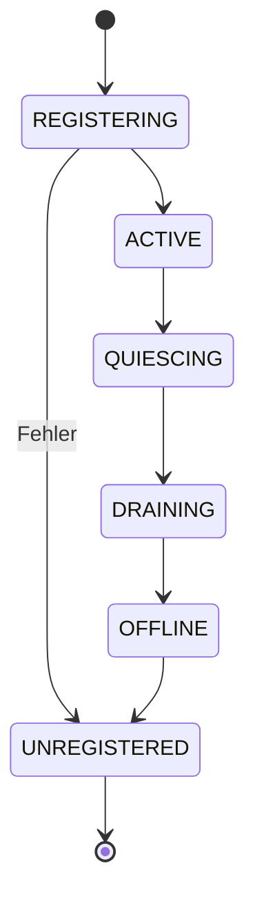
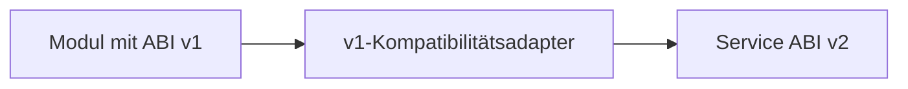

# NPSPEC-KERNEL-0105 – Versioned Kernel Service ABI

| Feld | Wert |
|---|---|
| Dokument-ID | NPSPEC-KERNEL-0105 |
| Titel | Versioned Kernel Service ABI |
| Status | Spezifikation |
| Version | 1.0 |
| Datum | 2026-08-03 |
| Bereich | Kernel / ABI / Kernel Services |
| Verantwortlich | NovaOS Architecture Team |
| Abhängigkeiten | NPSPEC-KERNEL-0011, NPSPEC-KERNEL-0012, NPSPEC-KERNEL-0025, NPSPEC-KERNEL-0030, NPSPEC-KERNEL-0102, NPSPEC-KERNEL-0103 |
| Zugehörige ADRs | ADR-KERNEL-0105 |

---

## 1. Zweck

Die Versioned Kernel Service ABI definiert eine stabile und versionierbare Schnittstelle für den Zugriff auf Kernelservices.

Sie ermöglicht:

- kontrollierte Weiterentwicklung des Kernels,
- Kompatibilität mit Kernelmodulen,
- stabile Schnittstellen für Systemkomponenten,
- parallele Unterstützung mehrerer Serviceversionen,
- explizite Feature-Erkennung,
- sichere ABI-Aushandlung,
- kontrollierte Ablösung veralteter Schnittstellen.

Kernelmodule und interne Komponenten sollen nicht direkt von veränderlichen Kernelstrukturen oder privaten Symbolen abhängen.

---

## 2. Geltungsbereich

Die Spezifikation gilt für:

- Kernelmodule
- Kernelinterne Subsysteme
- Kernelmodus-Treiber
- Architekturmodule
- optionale Kernelkomponenten
- Compatibility Layer
- Diagnose- und Sicherheitsmodule
- Boot- und Recovery-Komponenten

Die öffentliche Userspace-System-Call-ABI wird in einer eigenen Spezifikation beschrieben, darf aber dieselben Versionierungsprinzipien verwenden.

---

## 3. Entwurfsziele

Die Kernel Service ABI MUSS:

- Services eindeutig identifizieren,
- Major- und Minor-Versionen unterstützen,
- Strukturgrößen explizit angeben,
- optionale Funktionen erkennbar machen,
- ABI-Kompatibilität prüfen,
- Capability-basierte Servicezugriffe ermöglichen,
- mehrere Implementierungen eines Services erlauben,
- veraltete Services kontrolliert ablösen,
- Architekturunterschiede berücksichtigen,
- unsichere direkte Symbolabhängigkeiten reduzieren.

---

## 4. Nichtziele

Die ABI garantiert nicht:

- unveränderte interne Kernelstrukturen,
- dauerhafte Kompatibilität privater Funktionen,
- Quellcodekompatibilität ohne Anpassungen,
- Unterstützung beliebiger Fremdmodule,
- Kompatibilität mit Linux- oder Windows-Kerneltreibern,
- automatische Sicherheit eines Kernelmoduls,
- unbegrenzte Rückwärtskompatibilität.

Eine stabile ABI ersetzt keine sichere Modulsignierung oder Capability-Prüfung.

---

## 5. Grundmodell

Ein Kernelservice besteht aus:

| Bestandteil | Bedeutung |
|---|---|
| Service-ID | stabile globale Identität |
| Name | menschenlesbare Bezeichnung |
| Major-Version | inkompatible ABI-Generation |
| Minor-Version | kompatible Erweiterungsstufe |
| Service-Tabelle | Funktionszeiger und Metadaten |
| Feature-Maske | verfügbare optionale Funktionen |
| Capability-Anforderung | benötigte Berechtigung |
| Lebenszyklus | Registrierung bis Entfernung |
| Anbieter | implementierendes Kernelmodul oder Subsystem |

---

## 6. Service-Identität

Jeder öffentliche Kernelservice besitzt eine stabile UUID.

```c
typedef struct nova_service_id {
    uint8_t bytes[16];
} nova_service_id_t;
```

Die Service-ID bleibt über Umbenennungen und kompatible Weiterentwicklungen hinweg unverändert.

Eine neue inkompatible Servicefamilie SOLL eine neue Service-ID erhalten, wenn sie semantisch nicht mehr derselben Schnittstelle entspricht.

---

## 7. Serviceversion

```c
typedef struct nova_service_version {
    uint16_t major;
    uint16_t minor;
    uint16_t patch;
    uint16_t reserved;
} nova_service_version_t;
```

Die ABI-Kompatibilität wird primär durch Major- und Minor-Version bestimmt.

Die Patch-Version beschreibt Korrekturen ohne Änderung des ABI-Vertrags.

---

## 8. Versionsregeln

| Änderung | Versionsänderung |
|---|---|
| Fehlerkorrektur ohne ABI-Änderung | Patch |
| optionale Funktion am Tabellenende | Minor |
| neues optionales Strukturfeld am Ende | Minor |
| neue Feature-Maske | Minor |
| geänderte Funktionssignatur | Major |
| entfernte Funktion | Major |
| geänderte Feldbedeutung | Major |
| geändertes Alignment | Major |
| geänderte Aufrufkonvention | Major |

Eine Minor-Version darf bestehende Aufrufer derselben Major-Version nicht brechen.

---

## 9. Service-Deskriptor

```c
typedef struct nova_kernel_service_descriptor {
    uint32_t size;
    uint32_t descriptor_version;

    nova_service_id_t service_id;
    nova_service_version_t service_version;

    const char *name;
    const void *service_table;
    size_t service_table_size;

    uint64_t feature_mask;
    uint64_t required_capabilities;
    uint32_t flags;
    uint32_t architecture_mask;

    nova_module_id_t provider_module;
} nova_kernel_service_descriptor_t;
```

Der Deskriptor wird beim Service Registry Manager registriert.

---

## 10. Service-Tabelle

Eine Service-Tabelle enthält einen gemeinsamen Header.

```c
typedef struct nova_service_table_header {
    uint32_t size;
    uint16_t major_version;
    uint16_t minor_version;
    uint64_t feature_mask;
    uint64_t flags;
} nova_service_table_header_t;
```

Die Funktionszeiger folgen unmittelbar auf den Header.

Neue optionale Einträge dürfen bei kompatiblen Minor-Versionen ausschließlich am Ende ergänzt werden.

---

## 11. Beispiel einer Service-Tabelle

```c
typedef struct nova_memory_service_v1 {
    nova_service_table_header_t header;

    nova_status_t (*allocate_pages)(
        size_t page_count,
        uint32_t flags,
        nova_handle_t *out_memory
    );

    nova_status_t (*map_memory)(
        nova_handle_t memory,
        nova_virtual_address_t address,
        uint32_t protection
    );

    void (*unmap_memory)(
        nova_virtual_address_t address,
        size_t size
    );
} nova_memory_service_v1_t;
```

Aufrufer MÜSSEN die Tabellengröße prüfen, bevor optionale Einträge verwendet werden.

---

## 12. Registrierung

```c
nova_status_t nova_kernel_service_register(
    const nova_kernel_service_descriptor_t *descriptor,
    nova_service_registration_t *out_registration
);
```

Die Registrierung MUSS prüfen:

- Service-ID
- Versionsformat
- Tabellenzeiger und Tabellengröße
- erforderliche Basiseinträge
- Architekturkompatibilität
- Provider-Modul
- Capability-Deklaration
- Konflikte mit bestehenden Services
- Integrität des Anbieters

---

## 13. Serviceauflösung

```c
nova_status_t nova_kernel_service_acquire(
    const nova_service_request_t *request,
    nova_service_reference_t *out_reference
);
```

Eine Anfrage enthält mindestens:

```c
typedef struct nova_service_request {
    uint32_t size;
    uint32_t version;

    nova_service_id_t service_id;
    uint16_t minimum_major;
    uint16_t maximum_major;
    uint16_t minimum_minor;
    uint16_t reserved;

    uint64_t required_features;
    uint64_t optional_features;
    uint32_t flags;
} nova_service_request_t;
```

---

## 14. Versionsaushandlung

Die Service Registry wählt die höchste kompatible Version aus, sofern die Anfrage nichts anderes festlegt.

Eine Version ist kompatibel, wenn:

1. ihre Major-Version im erlaubten Bereich liegt,
2. ihre Minor-Version mindestens der geforderten Version entspricht,
3. alle erforderlichen Features vorhanden sind,
4. Architektur und Ausführungskontext passen,
5. der Aufrufer die benötigten Capabilities besitzt.

---

## 15. Aushandlungsbeispiel

| Anfrage | Verfügbare Versionen | Ergebnis |
|---|---|---|
| Major 1, Minor ≥ 2 | 1.0, 1.2, 1.5 | 1.5 |
| Major 1, Minor ≥ 4 | 1.2, 1.3 | nicht kompatibel |
| Major 1–2, Minor ≥ 0 | 1.7, 2.1 | 2.1 |
| Major 2, Feature DMA | 2.0 ohne DMA, 2.1 mit DMA | 2.1 |
| Major 3 | 1.5, 2.1 | nicht gefunden |

---

## 16. Service-Referenz

```c
typedef struct nova_service_reference {
    const void *service_table;
    size_t service_table_size;

    nova_service_version_t negotiated_version;
    uint64_t available_features;

    nova_service_token_t token;
    void *private_reference;
} nova_service_reference_t;
```

Eine gültige Service-Referenz hält den Anbieter so lange aktiv, bis sie freigegeben wird.

---

## 17. Freigabe

```c
void nova_kernel_service_release(
    nova_service_reference_t *reference
);
```

Nach der Freigabe dürfen Funktionszeiger und private Referenzen nicht mehr verwendet werden.

Jeder erfolgreiche `acquire`-Aufruf MUSS genau durch einen `release`-Aufruf abgeschlossen werden.

---

## 18. Feature-Erkennung

Optionale Funktionen werden über Feature-Bits angekündigt.

```c
#define NOVA_MEMORY_FEATURE_NUMA        (1ull << 0)
#define NOVA_MEMORY_FEATURE_HOTPLUG     (1ull << 1)
#define NOVA_MEMORY_FEATURE_HUGE_PAGES  (1ull << 2)
#define NOVA_MEMORY_FEATURE_ENCRYPTION  (1ull << 3)
```

Ein Feature-Bit darf nur gesetzt werden, wenn:

- die zugehörigen Funktionen vorhanden sind,
- die Tabellengröße diese Funktionen umfasst,
- die Implementierung den dokumentierten Vertrag erfüllt.

---

## 19. Strukturversionierung

Alle ABI-Strukturen beginnen mit Größen- und Versionsfeldern.

```c
typedef struct nova_service_operation_info {
    uint32_t size;
    uint32_t version;
    uint32_t flags;
    uint32_t reserved;
} nova_service_operation_info_t;
```

Ein Empfänger darf nur Felder lesen, die innerhalb der angegebenen Strukturgröße liegen.

---

## 20. Erweiterung von Strukturen

Kompatible Erweiterungen MÜSSEN folgende Regeln einhalten:

- neue Felder werden am Ende ergänzt,
- alte Felder ändern weder Position noch Bedeutung,
- neue Felder besitzen definierte Standardwerte,
- reservierte Felder müssen vom Aufrufer auf null gesetzt werden,
- unbekannte optionale Felder werden ignoriert,
- Alignment und Packing bleiben kompatibel.

---

## 21. Rückwärtskompatible Aufrufe

Ein neuer Anbieter muss ältere Aufrufer derselben Major-Version unterstützen.

Er erkennt ältere Strukturen anhand von:

- Strukturgröße
- Strukturversion
- Feature-Maske
- angeforderter Minor-Version

Fehlende neue Felder werden mit dokumentierten Standardwerten behandelt.

---

## 22. Vorwärtskompatible Aufrufe

Ein älterer Anbieter kann eine neuere Anfrage nur verarbeiten, wenn:

- die Basisschnittstelle kompatibel ist,
- neue Felder optional sind,
- keine unbekannten Pflichtflags gesetzt wurden,
- alle erforderlichen Features verfügbar sind.

Andernfalls MUSS `NOVA_STATUS_VERSION_MISMATCH` oder `NOVA_STATUS_FEATURE_UNAVAILABLE` zurückgegeben werden.

---

## 23. Pflicht- und optionale Flags

Flags werden in Pflicht- und optionale Bereiche aufgeteilt.

```c
#define NOVA_SERVICE_FLAG_REQUIRED_MASK  0x0000FFFFu
#define NOVA_SERVICE_FLAG_OPTIONAL_MASK  0xFFFF0000u
```

Unbekannte Pflichtflags führen zur Ablehnung.

Unbekannte optionale Flags dürfen ignoriert werden.

---

## 24. Aufrufkonvention

Jede Architektur definiert eine verbindliche Kernel-Service-Aufrufkonvention.

Festgelegt werden:

- Registerbelegung
- Stackausrichtung
- Parameterübergabe
- Rückgabewerte
- Registererhaltung
- Fehlercodeformat
- Gleitkomma- und SIMD-Verwendung
- Interruptzustand
- Unwind-Verhalten

C-Strukturen und Funktionszeiger müssen der NovaOS-Kernel-ABI entsprechen.

---

## 25. Architekturabhängigkeit

Ein Service kann:

- architekturunabhängig,
- architekturspezifisch,
- nur für eine CPU-Familie,
- nur für bestimmte Hardwaremerkmale

registriert werden.

```c
#define NOVA_ARCH_X86_32     (1u << 0)
#define NOVA_ARCH_X86_64     (1u << 1)
#define NOVA_ARCH_ARM64      (1u << 2)
#define NOVA_ARCH_RISCV64    (1u << 3)
#define NOVA_ARCH_ANY        0xFFFFFFFFu
```

Architekturspezifische Erweiterungen dürfen den gemeinsamen Basisteil nicht verändern.

---

## 26. Datentypen

Öffentliche ABI-Strukturen verwenden ausschließlich Typen mit definierter Größe.

Erlaubt sind beispielsweise:

- `uint8_t`
- `uint16_t`
- `uint32_t`
- `uint64_t`
- `int32_t`
- `int64_t`
- ABI-definierte Handles
- ABI-definierte Adresstypen
- versionierte Strukturen

Ungeeignet sind:

- Compiler-abhängige Enums ohne feste Größe,
- C-Bitfelder,
- unversionierte flexible Strukturen,
- direkte interne Kernelzeiger,
- compilerabhängige Klassenobjekte.

---

## 27. Zeiger und Speicherbesitz

Jeder Zeigerparameter MUSS bezüglich Besitz und Lebensdauer dokumentiert sein.

Mögliche Semantiken:

| Semantik | Bedeutung |
|---|---|
| Borrowed Input | nur während des Aufrufs lesbar |
| Borrowed Output | nur während definierter Referenz gültig |
| Caller Owned | Speicher gehört dem Aufrufer |
| Service Owned | Speicher gehört dem Anbieter |
| Transferred | Besitz wird übertragen |
| Shared | referenzgezählter gemeinsamer Besitz |

Unklare Besitzverhältnisse sind in öffentlichen Services unzulässig.

---

## 28. Handles statt interne Zeiger

Ressourcen werden bevorzugt über Handles oder Objekt-IDs übergeben.

Direkte Kernelzeiger dürfen nur verwendet werden, wenn:

- beide Komponenten derselben internen ABI-Domäne angehören,
- die Lebensdauer eindeutig geschützt ist,
- der Zeiger nicht an Userspace weitergegeben wird,
- der Vertrag ausdrücklich als interne ABI markiert ist.

Stabile Service-ABIs SOLLEN Objekt-Handles verwenden.

---

## 29. Fehlercodes

Servicefunktionen verwenden `nova_status_t`.

```c
typedef int32_t nova_status_t;
```

Statuscodes MÜSSEN:

- eindeutig sein,
- komponentenübergreifend interpretierbar sein,
- Erfolg, Warnung und Fehler unterscheiden,
- keine sensitiven internen Details offenlegen,
- bei Erweiterungen rückwärtskompatibel bleiben.

Unbekannte Fehlercodes werden als allgemeiner Fehler behandelt.

---

## 30. Capability-basierter Zugriff

Ein Service darf nur erworben oder verwendet werden, wenn der Aufrufer die notwendigen Capabilities besitzt.

Beispiele:

| Service | Capability |
|---|---|
| Memory Service | `KERNEL_SERVICE_MEMORY` |
| Device Service | `KERNEL_SERVICE_DEVICE` |
| Security Policy Service | `KERNEL_SERVICE_SECURITY_POLICY` |
| Module Service | `KERNEL_SERVICE_MODULE` |
| Diagnostics Service | `KERNEL_SERVICE_DIAGNOSTICS` |
| Power Service | `KERNEL_SERVICE_POWER` |

Ein erfolgreicher Service-Acquire ersetzt keine objektspezifischen Capability-Prüfungen bei späteren Operationen.

---

## 31. Capability-Bindung

Die Service-Referenz kann an Folgendes gebunden werden:

- aufrufendes Modul,
- Sicherheitsdomäne,
- Capability-Generation,
- Provider-Generation,
- Kernelgeneration,
- Architektur
- Ausführungskontext.

Wird eine relevante Capability widerrufen, müssen neue Serviceaufrufe fehlschlagen oder die Referenz kontrolliert ungültig werden.

---

## 32. Service-Lebenszyklus

Ein Service durchläuft folgende Zustände:

| Zustand | Bedeutung |
|---|---|
| `REGISTERING` | Registrierung wird geprüft |
| `ACTIVE` | Service kann erworben werden |
| `QUIESCING` | keine neuen Referenzen |
| `DRAINING` | bestehende Aufrufe werden abgeschlossen |
| `OFFLINE` | Service nicht mehr aufrufbar |
| `UNREGISTERED` | Service vollständig entfernt |

Zustandsübergänge MÜSSEN atomar erfolgen.

---

## 33. Service-Lebenszyklusdiagramm



---

## 34. Deregistrierung

```c
nova_status_t nova_kernel_service_unregister(
    nova_service_registration_t registration,
    uint32_t flags
);
```

Eine normale Deregistrierung MUSS:

1. neue Acquire-Anfragen stoppen,
2. laufende Aufrufe berücksichtigen,
3. bestehende Referenzen abbauen,
4. abhängige Komponenten benachrichtigen,
5. Service-Tabellen ungültig machen,
6. Provider-Ressourcen freigeben.

---

## 35. Laufende Aufrufe

Ein Provider darf nicht entladen werden, solange Servicefunktionen ausgeführt werden.

Die Registry verwaltet dazu:

- aktive Referenzen,
- laufende Aufrufe,
- Provider-Generation,
- Grace Periods,
- optional RCU-Epochen.

Neue Aufrufe müssen den Zustand des Services vor Eintritt in die Providerfunktion prüfen.

---

## 36. Hot Update

Eine kompatible Serviceimplementierung darf im laufenden Betrieb ersetzt werden.

Voraussetzungen:

- gleiche Service-ID,
- kompatible Major-Version,
- ausreichende Minor-Version,
- gleiche oder größere Pflichtfunktionsmenge,
- kompatible Zustandsübernahme,
- erfolgreiche Sicherheitsprüfung,
- definierter Rollback-Pfad.

Bestehende Referenzen dürfen je nach Servicevertrag auf der alten Implementierung verbleiben oder kontrolliert migriert werden.

---

## 37. Zustandsmigration

Ein aktualisierbarer Service SOLL optionale Migrationsoperationen bereitstellen.

```c
typedef struct nova_service_migration_ops {
    nova_status_t (*prepare)(
        nova_service_migration_context_t *context
    );

    nova_status_t (*export_state)(
        nova_service_migration_context_t *context,
        nova_handle_t *out_state
    );

    nova_status_t (*import_state)(
        nova_service_migration_context_t *context,
        nova_handle_t state
    );

    void (*commit)(
        nova_service_migration_context_t *context
    );

    void (*rollback)(
        nova_service_migration_context_t *context
    );
} nova_service_migration_ops_t;
```

Fehlgeschlagene Migrationen dürfen den bisherigen Service nicht unbrauchbar machen.

---

## 38. Parallele Major-Versionen

Mehrere Major-Versionen desselben Services dürfen parallel registriert sein.

Beispiel:

```text
Memory Service 1.6
Memory Service 2.2
```

Alte Module können Version 1 verwenden, während neue Module Version 2 nutzen.

Die parallele Unterstützung ist zeitlich begrenzt und unterliegt der Deprecation Policy.

---

## 39. Adapter

Ein Compatibility Adapter kann eine ältere Serviceversion auf eine neuere Implementierung abbilden.



Ein Adapter MUSS:

- das alte Verhalten korrekt abbilden,
- Fehlersemantik erhalten,
- Größen und Limits validieren,
- Sicherheitsprüfungen beibehalten,
- nicht unterstützte Funktionen eindeutig ablehnen.

---

## 40. Serviceabhängigkeiten

Ein Provider darf andere Services benötigen.

Abhängigkeiten werden in einem Manifest angegeben:

```yaml
services:
  provides:
    - id: "nova.device.manager"
      version: "2.1"
  requires:
    - id: "nova.object.manager"
      major: 1
      minor: 4
    - id: "nova.security.manager"
      major: 1
      minor: 2
      features:
        - capabilities
```

Zyklische harte Serviceabhängigkeiten sind unzulässig.

---

## 41. Optionale Abhängigkeiten

Optionale Serviceabhängigkeiten dürfen zusätzliche Funktionen aktivieren.

Fehlt eine optionale Abhängigkeit, MUSS der Provider:

- die betreffenden Feature-Bits entfernen,
- einen definierten degradierten Zustand verwenden,
- den Ausfall diagnostisch sichtbar machen,
- weiterhin sicher funktionieren.

---

## 42. Ladeordnung

Der Module Loader verwendet den Abhängigkeitsgraphen zur Bestimmung der Ladeordnung.

Grundlegende Reihenfolge:

1. minimale Kernel-Core-Services,
2. Object und Handle Manager,
3. Security und Capability Services,
4. Speicher- und CPU-Services,
5. Interrupt- und Timer-Services,
6. Device und Driver Services,
7. VFS und Netzwerkservices,
8. optionale Erweiterungen.

Nicht erfüllte Pflichtabhängigkeiten verhindern die Aktivierung des Moduls.

---

## 43. Service Registry

Die zentrale Service Registry verwaltet:

- registrierte Services,
- verfügbare Versionen,
- aktive Provider,
- Service-Referenzen,
- Feature-Masken,
- Capability-Anforderungen,
- Abhängigkeiten,
- Lebenszykluszustände,
- Deprecation-Informationen.

Die Registry ist selbst ein geschützter Kernel-Core-Service.

---

## 44. Mehrere Provider

Ein Service darf mehrere Provider besitzen, wenn der Servicevertrag dies erlaubt.

Mögliche Auswahlregeln:

- Priorität
- Architektur
- Hardwareplattform
- Sicherheitsprofil
- Leistungsprofil
- explizite Kernelkonfiguration
- Fallback-Reihenfolge

Die Auswahl MUSS deterministisch und diagnostisch nachvollziehbar sein.

---

## 45. Provider-Priorität

```c
typedef struct nova_service_provider_policy {
    int32_t priority;
    uint32_t flags;
    uint64_t platform_features;
    nova_uuid_t implementation_id;
} nova_service_provider_policy_t;
```

Eine höhere Priorität bedeutet nicht automatisch höhere Vertrauenswürdigkeit.

Signatur, Vertrauenskette und Sicherheitsrichtlinie werden getrennt geprüft.

---

## 46. Fallback-Provider

Für kritische Services darf eine minimale Fallback-Implementierung vorhanden sein.

Beispiele:

- einfacher Konsolen-Logger
- Basisspeicherallocator
- generischer Timer
- eingeschränkter Firmwarezugriff
- minimale Crash-Dump-Ausgabe

Der aktive Fallback-Modus MUSS als degradierter Zustand gemeldet werden.

---

## 47. Kernel Object Graph

Services, Provider und Abhängigkeiten werden im Kernel Object Graph dargestellt.

Beispiele:

```text
Module A --PROVIDES--> Service X v1.4
Module B --REQUIRES--> Service X v1.2+
Service X --USES--> Capability Framework
Service Y --FALLBACK_OF--> Service Z
```

Die Graphdarstellung unterstützt:

- Diagnose,
- Updateplanung,
- Abhängigkeitsanalyse,
- kontrollierte Entladung,
- Fehlerursachenanalyse.

---

## 48. Event-Bus-Integration

Die Service Registry veröffentlicht Ereignisse über den Event Bus.

| Ereignis | Bedeutung |
|---|---|
| `SERVICE_REGISTERED` | Service wurde registriert |
| `SERVICE_ACTIVATED` | Service ist verwendbar |
| `SERVICE_DEPRECATED` | Service wurde als veraltet markiert |
| `SERVICE_QUIESCING` | Service akzeptiert keine neuen Referenzen |
| `SERVICE_REPLACED` | Provider wurde ersetzt |
| `SERVICE_OFFLINE` | Service ist nicht verfügbar |
| `SERVICE_UNREGISTERED` | Service wurde entfernt |
| `SERVICE_COMPATIBILITY_FAILURE` | Versionsaushandlung ist fehlgeschlagen |

Ereignisse enthalten keine direkt verwendbaren Funktionszeiger.

---

## 49. Deprecation Policy

Ein Service oder Feature kann als veraltet markiert werden.

Die Deprecation-Information enthält:

- betroffene Version,
- Zeitpunkt der Markierung,
- empfohlene Ersatzversion,
- geplante Entfernung,
- Migrationshinweise,
- Sicherheitsrelevanz.

Veraltete Services dürfen nicht ohne dokumentierten Migrationspfad entfernt werden, außer sie stellen ein nicht vertretbares Sicherheitsrisiko dar.

---

## 50. Unterstützungszeiträume

Die konkrete Dauer wird durch die Release Policy definiert.

Grundsätzlich gilt:

- System-Call-ABIs erhalten die längste Unterstützung.
- Stabile Kernel-Service-ABIs erhalten definierte Kompatibilitätsreihen.
- Interne ABIs können sich schneller ändern.
- Experimentelle Services besitzen keine Stabilitätsgarantie.

Der Stabilitätsstatus MUSS im Service-Deskriptor angegeben sein.

---

## 51. Stabilitätsklassen

| Klasse | Bedeutung |
|---|---|
| `INTERNAL` | nur innerhalb eines Kernel-Builds |
| `EXPERIMENTAL` | Änderungen ohne Kompatibilitätsgarantie |
| `PROVISIONAL` | begrenzte Stabilität während Entwicklung |
| `STABLE` | garantierte ABI innerhalb definierter Reihe |
| `LEGACY` | weiterhin unterstützt, aber veraltet |
| `SECURITY_ONLY` | nur noch Sicherheitskorrekturen |

Produktive Drittmodule dürfen nur stabile oder ausdrücklich freigegebene Services verwenden.

---

## 52. Build-Identität

Jeder Kernel und jedes Modul besitzt eine Build-ID.

```c
typedef struct nova_build_identity {
    nova_uuid_t build_id;
    uint32_t abi_revision;
    uint32_t configuration_hash;
    uint64_t feature_mask;
} nova_build_identity_t;
```

Die Build-ID dient Diagnose und Symbolzuordnung, ersetzt aber nicht die Serviceversionsprüfung.

---

## 53. ABI-Fingerprint

Für Service-Tabellen kann ein ABI-Fingerprint erzeugt werden.

Der Fingerprint berücksichtigt:

- Feldreihenfolge
- Feldgrößen
- Alignment
- Funktionssignaturen
- Aufrufkonvention
- relevante Konstanten
- Architektur

Ein abweichender Fingerprint bei angeblich gleicher stabiler Version MUSS als Build- oder ABI-Fehler behandelt werden.

---

## 54. Modulmanifest

Ein Kernelmodul deklariert seine ABI-Anforderungen in einem Manifest.

```yaml
module:
  name: "nova.example.driver"
  abi:
    kernel: 1
    architecture: "x86_64"

  requires:
    - service: "nova.device.manager"
      major: 2
      minimum_minor: 1
      required_features:
        - device_binding

  provides:
    - service: "nova.example.control"
      major: 1
      minor: 0
```

Das Manifest wird vor Ausführung des Moduls validiert.

---

## 55. Modulsignierung

ABI-Kompatibilität und Vertrauenswürdigkeit sind getrennte Prüfungen.

Ein kompatibles Modul darf dennoch abgelehnt werden, wenn:

- die Signatur ungültig ist,
- der Herausgeber nicht vertrauenswürdig ist,
- die Richtlinie das Modul verbietet,
- benötigte Capabilities nicht gewährt werden,
- Secure-Boot- oder Recovery-Regeln verletzt werden.

---

## 56. Sicherheitsanforderungen

Die Service ABI MUSS verhindern, dass ein Modul durch manipulierte Metadaten:

- außerhalb einer Service-Tabelle liest,
- ungültige Funktionszeiger aufruft,
- Rechte erweitert,
- interne Kernelstrukturen interpretiert,
- fremde Provider entlädt,
- Versionsprüfungen umgeht,
- Sicherheitsservices ersetzt,
- veraltete Referenzen weiterverwendet.

Alle Größen-, Versions- und Featureangaben werden als nicht vertrauenswürdig behandelt.

---

## 57. Kontrollflussintegrität

Service-Tabellen SOLLEN nach der Registrierung schreibgeschützt sein.

Je nach Architektur können zusätzlich verwendet werden:

- Control Flow Integrity
- signierte Service-Deskriptoren
- Pointer Authentication
- Read-only Kernel Mapping
- Indirect Branch Tracking
- validierte Funktionszeigerbereiche

Servicefunktionszeiger dürfen nur auf ausführbare Bereiche des registrierten Providers zeigen.

---

## 58. Nebenläufigkeit

Die Service Registry MUSS parallele Acquire-, Release- und Aufrufoperationen unterstützen.

Dabei gelten folgende Regeln:

- häufige Serviceauflösungen benötigen keine globale Schreibsperre,
- Referenzzähler werden atomar verwaltet,
- Providerwechsel sind serialisiert,
- Tabellen werden nach Aktivierung nicht verändert,
- Freigabe erfolgt erst nach Abschluss geschützter Leser,
- Lifecycle-Callbacks werden nicht unter globalen Registry-Sperren ausgeführt.

---

## 59. RCU-Unterstützung

Für Serviceauflösung und Providerwechsel darf Read-Copy-Update verwendet werden.

Ein alter Provider darf erst freigegeben werden, wenn:

- keine Service-Referenzen bestehen,
- keine aktiven Aufrufe laufen,
- die RCU-Grace-Period abgeschlossen ist,
- keine Migrationsoperation mehr auf ihn verweist.

---

## 60. Interrupt-Kontext

Jede Servicefunktion MUSS ihren zulässigen Ausführungskontext deklarieren.

Mögliche Flags:

```c
#define NOVA_SERVICE_CALL_THREAD_CONTEXT     (1u << 0)
#define NOVA_SERVICE_CALL_INTERRUPT_SAFE     (1u << 1)
#define NOVA_SERVICE_CALL_NMI_SAFE           (1u << 2)
#define NOVA_SERVICE_CALL_EARLY_BOOT_SAFE    (1u << 3)
#define NOVA_SERVICE_CALL_PANIC_SAFE         (1u << 4)
#define NOVA_SERVICE_CALL_MAY_BLOCK          (1u << 5)
```

Ein Aufruf in einem unzulässigen Kontext MUSS abgelehnt oder in Checked-Builds als Fehler erkannt werden.

---

## 61. Early-Boot-Services

Vor Initialisierung der vollständigen Registry steht eine statische Early-Boot-Service-Tabelle zur Verfügung.

Sie enthält nur grundlegende Services wie:

- Boot Logging
- Basisspeicherverwaltung
- CPU-Erkennung
- Boot-Handoff-Zugriff
- frühe Interruptsteuerung
- Panic-Ausgabe

Nach Start der vollständigen Registry werden diese Services übernommen oder kontrolliert ersetzt.

---

## 62. Shutdown-Verhalten

Beim Shutdown:

1. werden neue optionale Service-Acquires abgelehnt,
2. abhängige Komponenten werden benachrichtigt,
3. Services werden in umgekehrter Abhängigkeitsreihenfolge beendet,
4. laufende Operationen werden abgeschlossen oder abgebrochen,
5. Provider werden deaktiviert,
6. minimale Shutdown- und Panic-Services bleiben verfügbar.

Die Registry selbst wird erst sehr spät abgeschaltet.

---

## 63. Panic-Services

Panic-sichere Services müssen:

- ohne dynamische Speicherallokation arbeiten,
- keine blockierenden Locks verwenden,
- auf vorbereitete Ressourcen zurückgreifen,
- keine normalen Userspace-Dienste benötigen,
- begrenzte und deterministische Laufzeiten besitzen.

Typische Panic-Services sind:

- Panic Logging
- CPU-State Capture
- Stack Capture
- Crash-Dump-Ausgabe
- kontrollierter Neustart oder Halt

---

## 64. Diagnose

Die Service Registry stellt autorisierten Diagnosewerkzeugen folgende Informationen bereit:

- Service-ID und Name
- registrierte Versionen
- aktiver Provider
- Stabilitätsklasse
- Feature-Maske
- Architektur
- Referenzzähler
- aktive Aufrufe
- Abhängigkeiten
- Lifecycle-Zustand
- Deprecation-Status
- letzte Kompatibilitätsfehler

Funktionsadressen werden standardmäßig maskiert.

---

## 65. Kernel Diagnostics Framework

Das Diagnostics Framework erfasst mindestens:

- erfolgreiche und fehlgeschlagene Serviceauflösungen,
- Versionskonflikte,
- fehlende Features,
- Providerwechsel,
- Migrationsfehler,
- lange Serviceaufrufe,
- nicht freigegebene Referenzen,
- Aufrufe in ungültigen Kontexten,
- Deregistrierungsprobleme.

Häufige erfolgreiche Aufrufe SOLLEN nicht standardmäßig einzeln protokolliert werden.

---

## 66. Auditierung

Folgende Operationen MÜSSEN auditiert werden:

- Registrierung eines privilegierten Services,
- Austausch eines Security-Providers,
- Laden eines Compatibility Adapters,
- erzwungene Deregistrierung,
- Hot Update eines kritischen Services,
- Umgehung einer Deprecation-Sperre,
- fehlgeschlagene Signatur- oder Vertrauensprüfung.

Auditdaten enthalten keine direkt verwendbaren Kerneladressen.

---

## 67. Fehlercodes

| Status | Bedeutung |
|---|---|
| `NOVA_STATUS_SUCCESS` | Operation erfolgreich |
| `NOVA_STATUS_SERVICE_NOT_FOUND` | Service ist nicht registriert |
| `NOVA_STATUS_VERSION_MISMATCH` | keine kompatible Version verfügbar |
| `NOVA_STATUS_FEATURE_UNAVAILABLE` | Pflichtfeature fehlt |
| `NOVA_STATUS_ABI_MISMATCH` | Tabellenlayout ist inkompatibel |
| `NOVA_STATUS_PROVIDER_CONFLICT` | Providerregistrierung kollidiert |
| `NOVA_STATUS_SERVICE_QUIESCING` | Service akzeptiert keine neuen Referenzen |
| `NOVA_STATUS_SERVICE_OFFLINE` | Service ist nicht mehr verfügbar |
| `NOVA_STATUS_ACCESS_DENIED` | Capability fehlt |
| `NOVA_STATUS_ARCH_MISMATCH` | Architektur ist nicht kompatibel |
| `NOVA_STATUS_DEPENDENCY_MISSING` | Pflichtabhängigkeit fehlt |
| `NOVA_STATUS_MIGRATION_FAILED` | Zustandsmigration ist fehlgeschlagen |
| `NOVA_STATUS_STALE_REFERENCE` | Service- oder Providergeneration ist veraltet |

---

## 68. Ressourcenlimits

Die Registry MUSS Limits unterstützen für:

- registrierte Services,
- Versionen pro Service,
- Provider pro Version,
- Abhängigkeiten pro Modul,
- Service-Referenzen pro Modul,
- Compatibility Adapter,
- parallele Migrationen,
- Größe von Service-Tabellen,
- Manifestgröße,
- Feature-Anzahl.

Ein fehlerhaftes Modul darf nicht unbegrenzt Kernelressourcen belegen.

---

## 69. Performance-Anforderungen

Die Implementierung SOLL folgende Ziele erfüllen:

- Serviceauflösung in logarithmischer oder amortisiert konstanter Zeit,
- keine globale Sperre bei regulären Serviceaufrufen,
- keine erneute Versionsaushandlung bei jedem Funktionsaufruf,
- schreibgeschützte, cachefreundliche Service-Tabellen,
- batchweise Aktualisierung von Registry-Ereignissen,
- geringe Kosten für Referenzschutz.

Capability- und Lifecycle-Prüfungen dürfen nicht durch Performanceoptimierungen umgangen werden.

---

## 70. ABI-Beschreibungsdateien

Service-ABIs SOLLEN maschinenlesbar beschrieben werden.

Die Beschreibungen enthalten:

- Service-ID
- Versionen
- Strukturen
- Funktionen
- Konstanten
- Feature-Bits
- Besitzsemantik
- Kontextregeln
- Fehlercodes
- Stabilitätsklasse

Aus diesen Dateien können Header, Dokumentation, ABI-Fingerprints und Kompatibilitätstests erzeugt werden.

---

## 71. Automatische ABI-Prüfung

Der Buildprozess MUSS stabile Services automatisch auf unbeabsichtigte ABI-Änderungen prüfen.

Geprüft werden:

- Strukturgrößen
- Feldoffsets
- Alignment
- Funktionssignaturen
- Tabellenreihenfolge
- Konstantenwerte
- Symbolsichtbarkeit
- ABI-Fingerprint

Inkompatible Änderungen ohne Major-Versionswechsel führen zu einem Buildfehler.

---

## 72. Testanforderungen

Die Implementierung MUSS mindestens folgende Tests enthalten:

- Registrierung und Auflösung eines Services
- Major- und Minor-Versionsaushandlung
- erforderliche und optionale Features
- zu kleine Service-Tabelle
- unbekannte Pflichtflags
- parallele Major-Versionen
- Capability-Verweigerung
- Providerkonflikte
- fehlende Abhängigkeiten
- Adapterbetrieb
- Service-Deregistrierung mit aktiven Referenzen
- Hot Update und Rollback
- Zustandsmigration
- RCU-basierter Providerwechsel
- Early-Boot-Übernahme
- Shutdown-Reihenfolge
- Panic-Service-Aufruf

---

## 73. Kompatibilitätstests

Für jede stabile ABI-Version MUSS eine Referenztestsuite existieren.

Sie prüft:

- Binärlayout
- Aufrufkonvention
- Fehlersemantik
- Feature-Erkennung
- Strukturgrößen
- Standardwerte neuer Felder
- Verhalten alter Aufrufer mit neuem Provider
- Verhalten neuer Aufrufer mit altem Provider
- Capability-Durchsetzung
- Lebensdauer von Service-Referenzen

---

## 74. Sicherheitstests

Zusätzliche Tests MÜSSEN prüfen:

- manipulierte Service-Deskriptoren
- ungültige Funktionszeiger
- übergroße Tabellenwerte
- Providerentladung während eines Aufrufs
- Use-after-release
- Service-Spoofing
- Capability-Widerruf bei aktiver Referenz
- bösartige Abhängigkeitsgraphen
- zyklische Pflichtabhängigkeiten
- ABI-Fingerprint-Manipulation
- Ersetzung sicherheitskritischer Provider

---

## 75. Fuzzing

Folgende Eingaben SOLLEN kontinuierlich gefuzzt werden:

- Service-Deskriptoren
- Versionsanfragen
- Feature-Masken
- Modulmanifeste
- Strukturgrößen
- Abhängigkeitsgraphen
- Migrationsdaten
- ABI-Beschreibungsdateien
- Compatibility Adapter
- Providerwechselzustände

Ungültige Eingaben müssen kontrolliert und ohne Beschädigung der Registry abgelehnt werden.

---

## 76. Verbindliche Invarianten

1. Eine stabile Minor-Version bricht keine bestehenden Aufrufer derselben Major-Version.
2. Inkompatible Änderungen erfordern eine neue Major-Version.
3. Neue optionale Tabellenfelder werden ausschließlich am Ende ergänzt.
4. Jeder Zugriff auf ein optionales Feld prüft Feature-Bit und Tabellengröße.
5. Ein Service-Provider wird nicht entladen, solange aktive Referenzen oder Aufrufe bestehen.
6. Eine Service-Referenz gewährt keine Rechte über die Capabilities des Aufrufers hinaus.
7. Service-Tabellen sind nach Aktivierung unveränderlich.
8. Direkte private Kernelsymbole gehören nicht zur stabilen Service ABI.
9. Unbekannte Pflichtflags führen zur Ablehnung.
10. Fehler bei Hot Update oder Migration lassen den bisherigen Service funktionsfähig.
11. Serviceabhängigkeiten werden vor Aktivierung vollständig geprüft.
12. Ein veralteter Service wird nicht ohne definierten Migrationspfad entfernt, sofern kein zwingendes Sicherheitsrisiko besteht.
13. Funktionszeiger zeigen ausschließlich in gültige ausführbare Bereiche des Providers.
14. Panic-Services verwenden nur panic-sichere Abhängigkeiten.
15. Jede stabile ABI besitzt automatisierte Layout- und Kompatibilitätstests.

---

## 77. Referenzablauf: Service erwerben

```c
nova_service_request_t request = {
    .size = sizeof(request),
    .version = 1,
    .service_id = NOVA_MEMORY_SERVICE_ID,
    .minimum_major = 1,
    .maximum_major = 1,
    .minimum_minor = 2,
    .required_features = NOVA_MEMORY_FEATURE_NUMA
};

nova_service_reference_t reference;

nova_status_t status = nova_kernel_service_acquire(
    &request,
    &reference
);

if (NOVA_FAILED(status)) {
    return status;
}

const nova_memory_service_v1_t *memory =
    (const nova_memory_service_v1_t *)reference.service_table;
```

---

## 78. Referenzablauf: Optionale Funktion prüfen

```c
if ((reference.available_features &
     NOVA_MEMORY_FEATURE_HUGE_PAGES) != 0 &&
    reference.service_table_size >=
        offsetof(nova_memory_service_v1_t, allocate_huge_pages) +
        sizeof(memory->allocate_huge_pages) &&
    memory->allocate_huge_pages != NULL) {

    status = memory->allocate_huge_pages(
        page_count,
        flags,
        &memory_handle
    );
} else {
    status = NOVA_STATUS_FEATURE_UNAVAILABLE;
}
```

---

## 79. Referenzablauf: Service freigeben

```c
nova_kernel_service_release(&reference);

reference.service_table = NULL;
reference.service_table_size = 0;
```

Nach der Freigabe darf kein Funktionszeiger aus der Tabelle mehr aufgerufen werden.

---

## 80. Implementierungsphasen

### Phase 1

- Service Registry
- Service-IDs
- Versionsaushandlung
- Service-Tabellen
- Referenzverwaltung

### Phase 2

- Capability-Integration
- Feature-Erkennung
- Modulmanifeste
- Abhängigkeitsauflösung
- Diagnoseereignisse

### Phase 3

- parallele Major-Versionen
- Compatibility Adapter
- Hot Update
- Zustandsmigration
- Deprecation Policy

### Phase 4

- maschinenlesbare ABI-Beschreibungen
- automatische Headergenerierung
- ABI-Fingerprints
- formale Kompatibilitätsprüfung
- architekturübergreifende Tests

---

## 81. Zusammenfassung

Die Versioned Kernel Service ABI stellt eine kontrollierte und langfristig wartbare Schnittstelle zwischen NovaOS-Kernelkomponenten bereit.

Sie definiert:

- stabile Service-Identitäten,
- Major-, Minor- und Patch-Versionen,
- explizit dimensionierte Service-Tabellen,
- Feature-Aushandlung,
- capability-basierte Zugriffe,
- sichere Provider-Lebenszyklen,
- parallele ABI-Generationen,
- Compatibility Adapter,
- Hot Updates und Zustandsmigration,
- automatisierte ABI-Kompatibilitätsprüfungen.

Damit kann NovaOS seinen Kernel weiterentwickeln, ohne sämtliche Module und Systemkomponenten bei jeder internen Änderung neu entwerfen zu müssen.